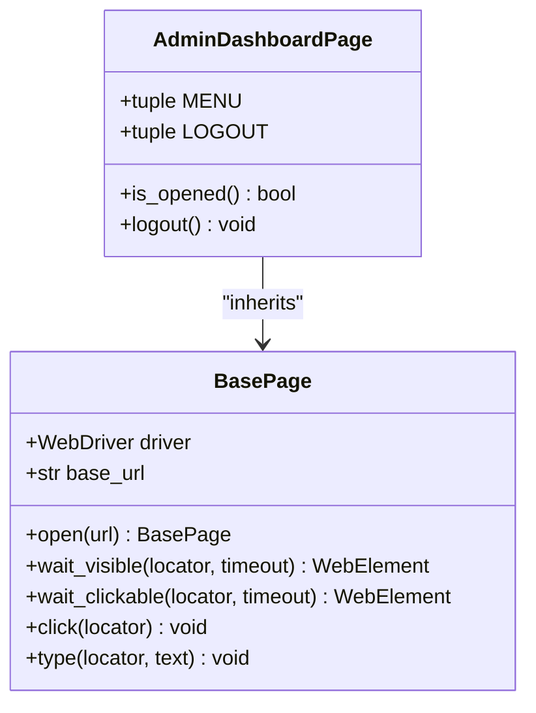
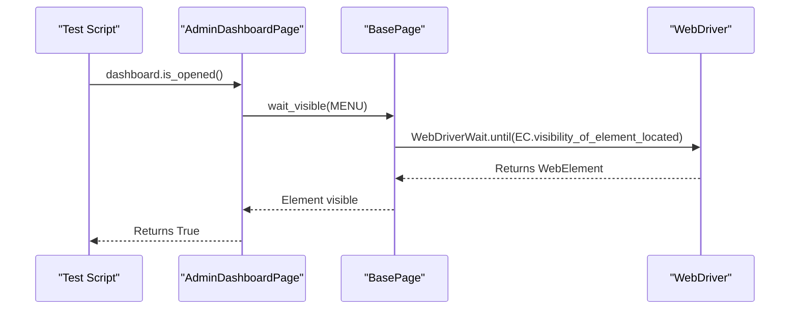
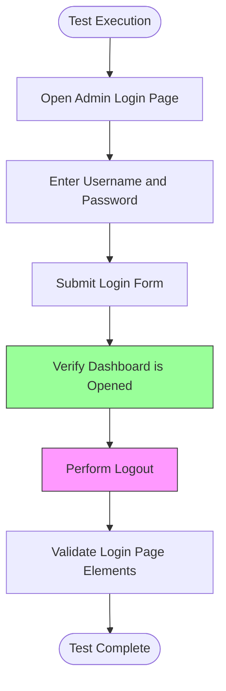

# Admin Dashboard

<cite>
**Referenced Files in This Document**   
- [admin_dashboard_page.py](file://pages/admin/admin_dashboard_page.py)
- [admin_login_page.py](file://pages/admin/admin_login_page.py)
- [test_admin_login_po.py](file://tests/test_admin_login_po.py)
- [base.py](file://pages/base.py)
- [waits.py](file://utils/waits.py)
</cite>

## Table of Contents
1. [Introduction](#introduction)
2. [Core Components](#core-components)
3. [Dashboard Verification and Authentication Check](#dashboard-verification-and-authentication-check)
4. [Navigation and User Interactions](#navigation-and-user-interactions)
5. [Handling Dynamic Content with Explicit Waits](#handling-dynamic-content-with-explicit-waits)
6. [Test Implementation Example](#test-implementation-example)
7. [Best Practices for Dashboard State Validation](#best-practices-for-dashboard-state-validation)
8. [Integration into Test Workflows](#integration-into-test-workflows)

## Introduction
The AdminDashboardPage represents the primary landing interface after a successful login to OpenCart's administrative panel. This page serves as the central hub for accessing various backend functionalities such as product management, sales analytics, and system configurations. The dashboard's presence confirms successful authentication and provides quick access to core administrative modules through a sidebar navigation menu.

## Core Components

The `AdminDashboardPage` class encapsulates the structure and behavior of the post-login admin interface. It inherits from `BasePage`, enabling standardized interaction patterns across the test framework. Key elements include the main navigation menu and logout functionality.

**Diagram sources**
- [admin_dashboard_page.py](file://pages/admin/admin_dashboard_page.py#L1-L12)
- [base.py](file://pages/base.py#L1-L35)

**Section sources**
- [admin_dashboard_page.py](file://pages/admin/admin_dashboard_page.py#L1-L12)

## Dashboard Verification and Authentication Check

Authentication success is validated by confirming the visibility of dashboard-specific elements. The `is_opened()` method in `AdminDashboardPage` checks for the presence of the main menu using an explicit wait condition. This approach ensures that the page has fully loaded before proceeding with further actions.

The primary verification element is the sidebar menu identified by the ID `menu`. Its visibility indicates that the user has successfully navigated past the login screen and reached the authenticated dashboard environment.

**Section sources**
- [admin_dashboard_page.py](file://pages/admin/admin_dashboard_page.py#L9-L11)

## Navigation and User Interactions

The dashboard supports navigation between major administrative sections such as Catalog, Sales, and Extensions via the sidebar menu. Although these specific links are not directly defined in the current implementation, the presence of the `MENU` element confirms that the navigation structure is available for interaction.

Users can also initiate a logout action through the `logout()` method, which clicks on the logout link identified by a CSS selector containing the `logout` parameter in the href attribute. This provides a clean way to terminate the session programmatically during test execution.

**Section sources**
- [admin_dashboard_page.py](file://pages/admin/admin_dashboard_page.py#L7-L12)

## Handling Dynamic Content with Explicit Waits

The framework utilizes explicit waits to handle dynamic content loading, ensuring reliable test execution. The `wait_visible()` method from `BasePage` is used to wait for elements to become visible within a specified timeout period (default 10 seconds). This method leverages Selenium's `WebDriverWait` and `expected_conditions` to poll the DOM until the target element appears.

Additionally, the utility module `waits.py` provides standalone wait functions like `wait_element()`, `wait_all()`, and `wait_title()` that can be used for more granular control over synchronization in test scenarios.

**Diagram sources**
- [admin_dashboard_page.py](file://pages/admin/admin_dashboard_page.py#L9-L11)
- [base.py](file://pages/base.py#L20-L25)

## Test Implementation Example

The `test_admin_login_po.py` file demonstrates how to validate dashboard access after login. The test initializes the `LoginPage`, performs credential submission, and instantiates the `AdminDashboardPage` to verify successful authentication.

After logging in, the test calls `dashboard.is_opened()` to confirm the dashboard is accessible. It then executes a logout action and verifies that login page elements are visible again, completing the authentication cycle.

**Diagram sources**
- [test_admin_login_po.py](file://tests/test_admin_login_po.py#L10-L19)
- [admin_dashboard_page.py](file://pages/admin/admin_dashboard_page.py#L9-L11)

**Section sources**
- [test_admin_login_po.py](file://tests/test_admin_login_po.py#L1-L19)

## Best Practices for Dashboard State Validation

When validating dashboard state, always use explicit waits instead of fixed timeouts to improve test reliability. The `is_opened()` method should check for elements that are unique to the dashboard and appear only after successful authentication.

Consider implementing additional verification points such as checking the page title or specific dashboard widgets if available. For permission-based UI variations, design flexible locators or conditional checks that adapt to different user roles.

Ensure that all interactions with dashboard elements are wrapped in appropriate wait conditions to handle network latency or server-side processing delays.

**Section sources**
- [admin_dashboard_page.py](file://pages/admin/admin_dashboard_page.py#L9-L11)
- [base.py](file://pages/base.py#L20-L25)

## Integration into Test Workflows

The dashboard verification can be integrated into broader test workflows as a prerequisite step. After any login operation, calling `is_opened()` ensures that subsequent actions are performed in the correct context.

This pattern can be extended to other admin pages by creating similar page objects with their own `is_opened()` implementations. The logout functionality also enables clean session management between test cases, preventing state leakage.

**Section sources**
- [test_admin_login_po.py](file://tests/test_admin_login_po.py#L1-L19)
- [admin_dashboard_page.py](file://pages/admin/admin_dashboard_page.py#L7-L12)