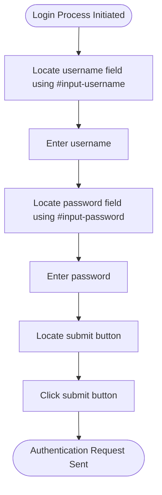
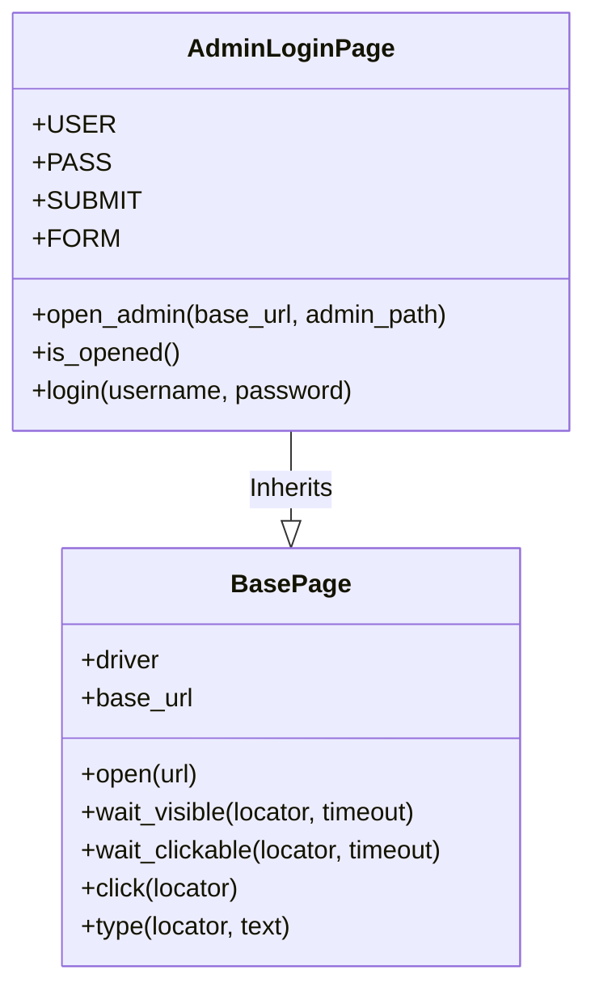
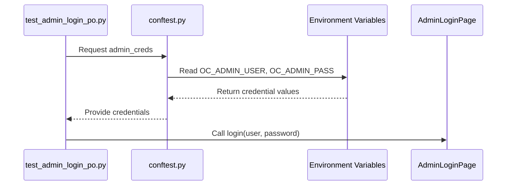

# Admin Login

<cite>
**Referenced Files in This Document**   
- [admin_login_page.py](file://pages/admin/admin_login_page.py)
- [base.py](file://pages/base.py)
- [conftest.py](file://conftest.py)
- [test_admin_login_po.py](file://tests/test_admin_login_po.py)
</cite>

## Table of Contents
1. [Introduction](#introduction)
2. [AdminLoginPage Component Overview](#adminloginpage-component-overview)
3. [Element Locators and Form Interaction](#element-locators-and-form-interaction)
4. [Inheritance from BasePage](#inheritance-from-basepage)
5. [Credential Management via Fixtures](#credential-management-via-fixtures)
6. [POM-Based Login Validation and Error Handling](#pom-based-login-validation-and-error-handling)
7. [Best Practices for Reliable Login Testing](#best-practices-for-reliable-login-testing)
8. [Common Issues and Mitigation Strategies](#common-issues-and-mitigation-strategies)
9. [Conclusion](#conclusion)

## Introduction
This document provides a comprehensive analysis of the `AdminLoginPage` component used for authenticating into the OpenCart admin backend. It details the implementation of login form interactions, element locators, inheritance from `BasePage`, credential handling via pytest fixtures, and best practices for writing robust login tests using the Page Object Model (POM). The analysis is based on actual source files and demonstrates how authentication workflows are structured and validated.

## AdminLoginPage Component Overview
The `AdminLoginPage` class encapsulates the behavior and elements of the OpenCart admin login interface. It extends `BasePage` to inherit common web interaction methods such as typing and clicking. This design promotes code reusability and maintainability by centralizing shared functionality.

The component supports opening the admin login page via a customizable URL path and verifies that the page has loaded correctly by checking both the visibility of key elements and the presence of "Administration" in the page title.

**Section sources**
- [admin_login_page.py](file://pages/admin/admin_login_page.py#L3-L24)

## Element Locators and Form Interaction
The `AdminLoginPage` defines precise locators for all critical form elements using CSS selectors:

- **Username Field**: `#input-username`
- **Password Field**: `#input-password`
- **Submit Button**: `button[type='submit']`
- **Login Form**: `form`

These locators are declared as class-level tuples using Selenium’s `By` syntax, enabling clean and readable element references throughout the code. The `login()` method orchestrates the authentication process by sequentially typing the username and password, then clicking the submit button.

**Diagram sources**
- [admin_login_page.py](file://pages/admin/admin_login_page.py#L5-L8)

## Inheritance from BasePage
The `AdminLoginPage` inherits from `BasePage`, which provides foundational methods for browser automation:

- `open(url)`: Navigates to a specified URL
- `wait_visible(locator)`: Waits for an element to be visible
- `wait_clickable(locator)`: Waits for an element to be clickable
- `type(locator, text)`: Clears and sends text to an input field
- `click(locator)`: Clicks an element, with fallback scroll-and-click logic if blocked

This inheritance enables `AdminLoginPage` to leverage robust waiting and interaction strategies without duplicating code. For example, `type()` ensures fields are cleared before input, reducing state-related test failures.

**Diagram sources**
- [base.py](file://pages/base.py#L4-L34)
- [admin_login_page.py](file://pages/admin/admin_login_page.py#L3-L24)

## Credential Management via Fixtures
Credentials for admin login are securely managed through pytest fixtures defined in `conftest.py`. The `admin_creds` fixture retrieves credentials either from command-line arguments or environment variables (`OC_ADMIN_USER`, `OC_ADMIN_PASS`). This approach decouples sensitive data from the test code and allows flexible configuration across environments.

Additionally, the `base_url` and `admin_path` fixtures support dynamic test configuration, enabling tests to run against different OpenCart instances or admin paths without code changes.

**Diagram sources**
- [conftest.py](file://conftest.py#L50-L57)

## POM-Based Login Validation and Error Handling
The test file `test_admin_login_po.py` demonstrates how the Page Object Model is used to validate successful login and handle errors. It uses the `LoginPage` (which shares the same locators as `AdminLoginPage`) to perform login actions and verify that the `AdminDashboardPage` opens correctly.

If credentials are missing, the test gracefully skips execution using `pytest.skip()`, preventing false failures due to misconfiguration. After login, it validates dashboard visibility and performs logout, then confirms the return to the login form by waiting for username and password fields.

This pattern ensures that login logic is tested in isolation while maintaining clear separation between test logic and page behavior.

**Section sources**
- [test_admin_login_po.py](file://tests/test_admin_login_po.py#L7-L19)

## Best Practices for Reliable Login Testing
To ensure reliable login testing, the following best practices are implemented:

- **Explicit Waits**: All element interactions use `wait_visible()` or `wait_clickable()` to avoid timing issues.
- **Dynamic URL Configuration**: Admin path and base URL are parameterized via fixtures.
- **Environment-Safe Credentials**: Sensitive data is sourced from environment variables.
- **Graceful Skip on Missing Data**: Tests skip rather than fail when credentials are not provided.
- **Session Persistence**: Browser session is reused across steps to simulate real user flow.
- **CSRF and Redirect Handling**: Implicitly handled by using actual page navigation and form submission.

These practices collectively enhance test stability and reduce flakiness in CI/CD pipelines.

## Common Issues and Mitigation Strategies
Several common issues arise during admin login testing:

- **Stale Elements**: Occur when DOM changes after navigation. Mitigated by re-locating elements after redirects.
- **Timing Issues**: Addressed through explicit waits in `BasePage`.
- **Incorrect Admin Path**: Resolved by configurable `admin_path` fixture.
- **Headless Mode Rendering Differences**: Handled via consistent window sizing and scroll-before-click fallbacks in `click()`.

The `click()` method in `BasePage` includes a JavaScript fallback to scroll elements into view and trigger clicks programmatically, effectively bypassing visibility obstructions.

**Section sources**
- [base.py](file://pages/base.py#L28-L34)

## Conclusion
The `AdminLoginPage` component exemplifies effective use of the Page Object Model in Selenium-based testing. By combining inheritance, explicit waits, secure credential management, and robust error handling, it enables reliable and maintainable admin login tests. The integration with pytest fixtures allows flexible configuration, while the separation of concerns between page logic and test logic enhances readability and scalability. Following these patterns ensures stable automation of critical authentication workflows in OpenCart.