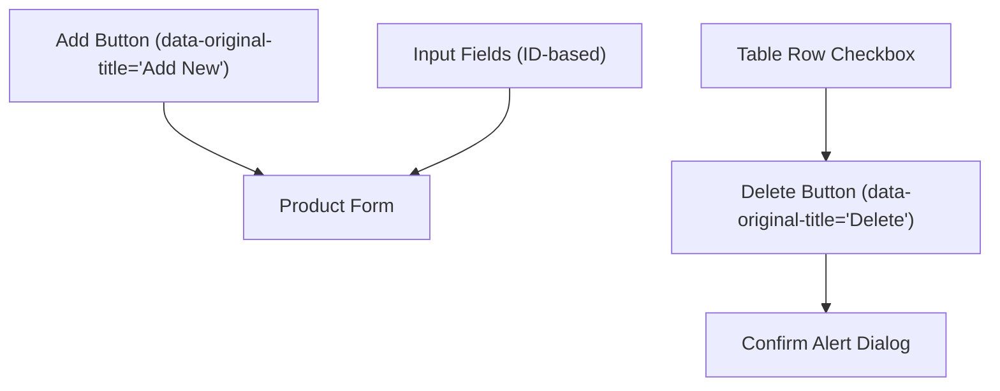
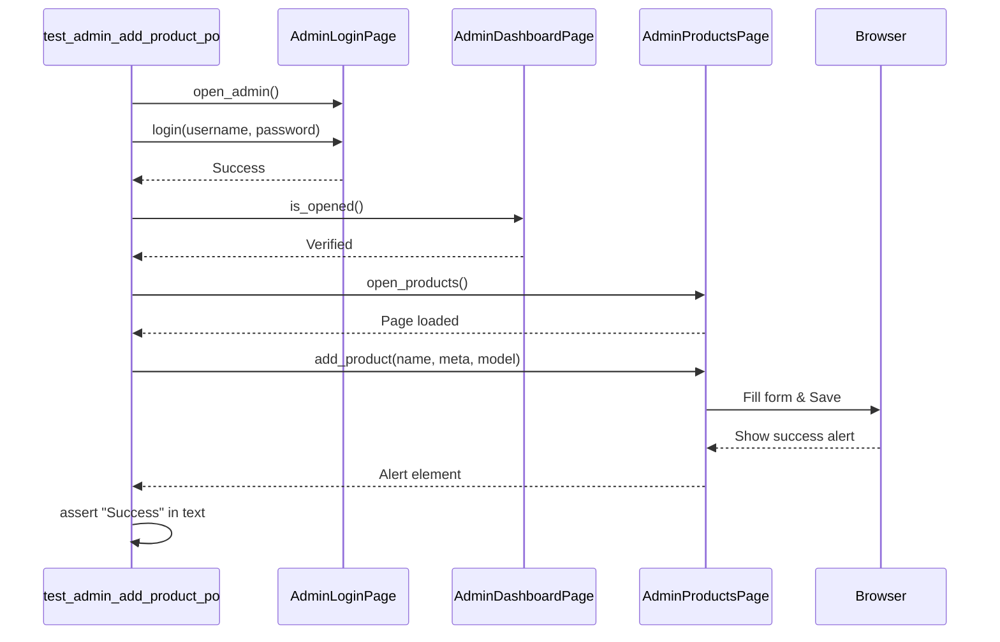
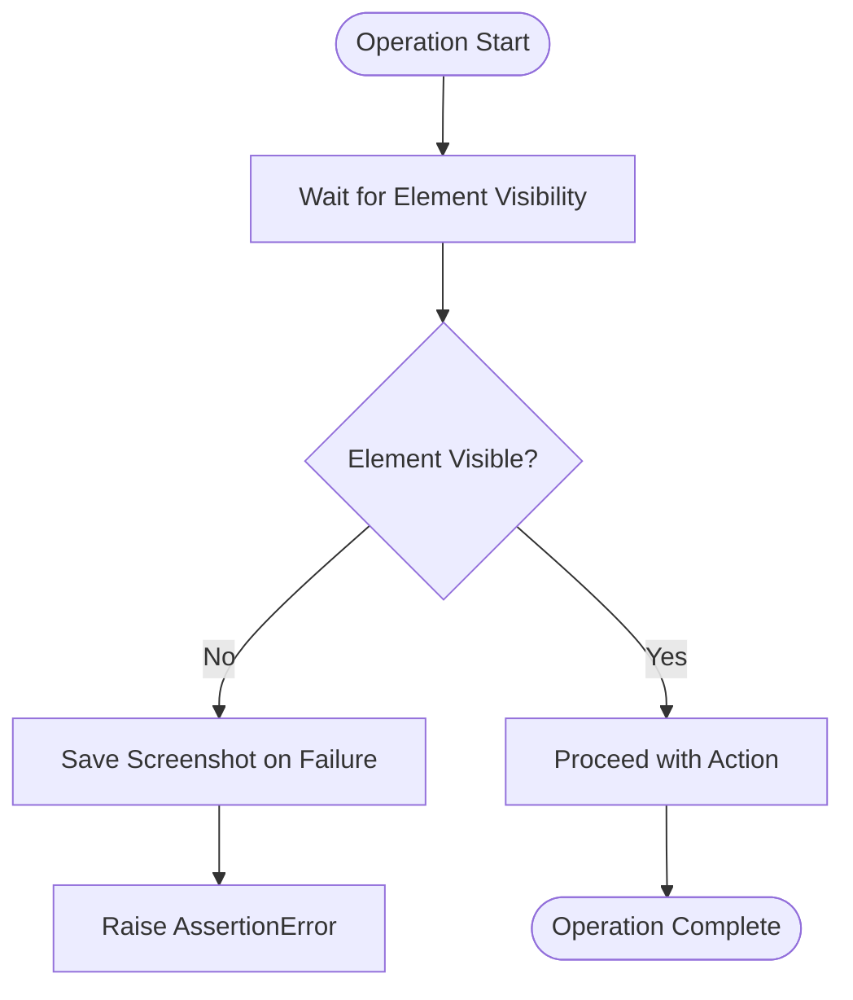

# Admin Product Management

<cite>
**Referenced Files in This Document**   
- [admin_products_page.py](file://pages/admin/admin_products_page.py)
- [test_admin_products_po.py](file://tests/test_admin_products_po.py)
- [base.py](file://pages/base.py)
- [utils/waits.py](file://utils/waits.py)
- [admin_login_page.py](file://pages/admin/admin_login_page.py)
- [admin_dashboard_page.py](file://pages/admin/admin_dashboard_page.py)
</cite>

## Table of Contents
1. [Introduction](#introduction)
2. [Core Operations](#core-operations)
3. [Dynamic Selectors and UI Elements](#dynamic-selectors-and-ui-elements)
4. [Modal and Confirmation Dialog Handling](#modal-and-confirmation-dialog-handling)
5. [Test Workflow Implementation](#test-workflow-implementation)
6. [Wait Strategies and AJAX Integration](#wait-strategies-and-ajax-integration)
7. [Best Practices for Data Management](#best-practices-for-data-management)
8. [Conclusion](#conclusion)

## Introduction
The AdminProductsPage is a Page Object Model (POM) implementation designed to manage product inventory within the OpenCart admin interface. It enables automated interaction with key product management functions such as adding, editing, and deleting products. Built on top of a robust base class, it leverages Selenium WebDriver with explicit waits and dynamic element resolution to ensure reliable test execution in AJAX-driven environments.

This document details the structure, functionality, and usage patterns of the AdminProductsPage, focusing on its integration with OpenCart’s administrative UI and backend workflows.

**Section sources**
- [admin_products_page.py](file://pages/admin/admin_products_page.py#L1-L39)

## Core Operations

### Adding a New Product
The `add_product()` method facilitates the creation of new products by programmatically filling essential fields including name, model, and SEO metadata. It navigates through the product creation form, inputs provided values, and submits the form via the Save button. The method returns a visibility-waited success alert element, confirming successful persistence.

Key fields:
- **Name**: Entered into `#input-name1`
- **Meta Title**: Entered into `#input-meta-title1`
- **Model**: Entered under the Data tab using `#input-model`

### Deleting a Product
The `delete_first_product()` method performs bulk deletion of the first product listed in the table. It selects the checkbox in the first row using a precise CSS selector, triggers the Delete action, and handles the browser’s native JavaScript alert dialog. After confirmation, it waits for the success notification to appear.

### Editing Product Details
While not explicitly implemented as a separate method, editing is achieved by navigating to an existing product entry (via the same UI flow as adding), modifying field values, and saving—handled through shared logic in the `add_product()` method.

**Section sources**
- [admin_products_page.py](file://pages/admin/admin_products_page.py#L20-L39)

## Dynamic Selectors and UI Elements

The AdminProductsPage uses stable, semantic CSS and attribute-based selectors to interact with dynamic UI components:

| Element | Selector | Purpose |
|--------|---------|--------|
| "Add New" Button | `a[data-original-title='Add New'], .btn-primary` | Triggers product creation form |
| "Delete" Button | `button[data-original-title='Delete'], .btn-danger` | Initiates bulk delete action |
| Success Alert | `.alert-success` | Confirms operation success |
| Product Table Checkbox | `table tbody tr:first-child input[type='checkbox']` | Selects first product for deletion |
| Name Input | `#input-name1` | Primary product name field |
| Model Input | `#input-model` | Internal product model identifier |

These selectors are resilient to minor DOM changes and prioritize semantic attributes like `data-original-title`, which are less likely to change than class names.



**Diagram sources**
- [admin_products_page.py](file://pages/admin/admin_products_page.py#L5-L15)

## Modal and Confirmation Dialog Handling

The page interacts with two types of modals:
1. **Form Modals**: The product creation/edit form is a standard HTML form loaded via navigation. No modal overlay is used.
2. **Browser Alert Dialogs**: Upon deletion, OpenCart triggers a native JavaScript `alert`. This is handled using Selenium’s `switch_to.alert` API.

In `delete_first_product()`, after clicking the Delete button, the script switches to the active alert and accepts it:
```python
alert = self.driver.switch_to.alert
alert.accept()
```
This pattern ensures that the confirmation is programmatically dismissed, allowing the test to proceed.

**Section sources**
- [admin_products_page.py](file://pages/admin/admin_products_page.py#L34-L39)

## Test Workflow Implementation

The `test_admin_products_po.py` file demonstrates a complete end-to-end workflow using the AdminProductsPage:

### Test: Add Product
1. Skips test if admin credentials are missing
2. Logs in via `LoginPage.open_admin().login()`
3. Verifies dashboard access via `AdminDashboardPage.is_opened()`
4. Navigates to Products via `AdminProductsPage.open_products()`
5. Adds a uniquely named product using timestamp suffix
6. Validates presence of "Success" text in the alert

### Test: Delete First Product
1. Repeats login and navigation steps
2. Invokes `delete_first_product()`
3. Asserts success message visibility

Both tests use dynamic data generation to prevent conflicts from duplicate product names.



**Diagram sources**
- [test_admin_products_po.py](file://tests/test_admin_products_po.py#L7-L19)
- [test_admin_products_po.py](file://tests/test_admin_products_po.py#L22-L33)

**Section sources**
- [test_admin_products_po.py](file://tests/test_admin_products_po.py#L7-L33)

## Wait Strategies and AJAX Integration

The framework relies on explicit waits to handle asynchronous UI updates:

- **BasePage.wait_visible()**: Uses `WebDriverWait` with `EC.visibility_of_element_located` to wait for elements to become visible.
- **BasePage.wait_clickable()**: Ensures elements are both present and enabled before interaction.
- **Custom Waits in utils/waits.py**: Provides reusable functions like `wait_element()`, `wait_all()`, and `wait_title()` with screenshot capture on failure.

These utilities integrate seamlessly with OpenCart’s AJAX behavior, ensuring that tests do not proceed until critical elements (e.g., success alerts) are fully rendered.



**Diagram sources**
- [base.py](file://pages/base.py#L15-L25)
- [utils/waits.py](file://utils/waits.py#L5-L30)

## Best Practices for Data Management

### Data Isolation
Each test generates unique product names using timestamps (`str(int(time.time()))`), preventing naming conflicts and enabling safe parallel execution.

### Cleanup Strategy
Currently, deletion is tested independently but not used as cleanup in the add test. Best practice would be to combine both operations in a single test or use fixtures to clean up created products.

### Handling Duplicate Constraints
OpenCart enforces uniqueness on product names and models. To avoid constraint violations:
- Always use dynamically generated names
- Avoid hardcoding test data
- Implement cleanup via `delete_product_by_name()` if needed

### Error Resilience
The `click()` method in `BasePage` includes a fallback scroll-and-execute_script mechanism to handle cases where elements are not clickable due to viewport clipping.

**Section sources**
- [test_admin_products_po.py](file://tests/test_admin_products_po.py#L16-L17)
- [base.py](file://pages/base.py#L27-L35)

## Conclusion
The AdminProductsPage provides a clean, maintainable interface for automating product management tasks in OpenCart. Its design emphasizes resilience through robust selectors, proper wait strategies, and separation of concerns via the Page Object Model. When combined with dynamic data generation and proper cleanup, it enables reliable, repeatable testing of critical inventory operations.

Future improvements could include methods for editing specific products by name and enhanced error handling for duplicate constraints.