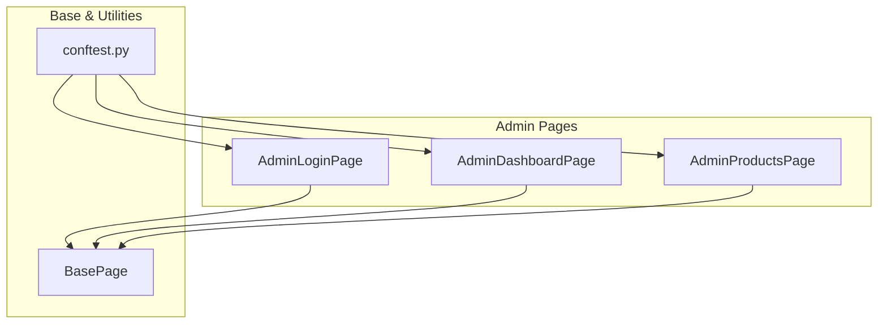

# Admin Testing

<cite>
**Referenced Files in This Document**   
- [admin_login_page.py](file://pages/admin/admin_login_page.py)
- [admin_dashboard_page.py](file://pages/admin/admin_dashboard_page.py)
- [admin_products_page.py](file://pages/admin/admin_products_page.py)
- [test_admin_products_po.py](file://tests/test_admin_products_po.py)
- [conftest.py](file://conftest.py)
- [login_page.py](file://pages/login_page.py)
</cite>

## Table of Contents
1. [Introduction](#introduction)
2. [Core Components Overview](#core-components-overview)
3. [AdminLoginPage: Authentication Workflow](#adminloginpage-authentication-workflow)
4. [AdminDashboardPage: Post-Login Navigation](#admindashboardpage-post-login-navigation)
5. [AdminProductsPage: Product Management Operations](#adminproductspage-product-management-operations)
6. [Test Workflows and Page Transitions](#test-workflows-and-page-transitions)
7. [Locator Strategy and Element Identification](#locator-strategy-and-element-identification)
8. [Secure Handling of Admin Credentials](#secure-handling-of-admin-credentials)
9. [Best Practices for Robust Admin Testing](#best-practices-for-robust-admin-testing)
10. [Conclusion](#conclusion)

## Introduction
This document provides comprehensive guidance on testing the administrative interface of OpenCart using a Page Object Model (POM) framework. It focuses on three core admin pages: AdminLoginPage for authentication, AdminDashboardPage for post-login verification, and AdminProductsPage for product management operations such as adding, editing, and deleting products. The analysis is based on actual implementation in the codebase, with emphasis on secure credential handling, dynamic content management, and robust test design patterns.

## Core Components Overview
The administrative testing framework is structured around page-specific classes that encapsulate locators and actions, promoting reusability and maintainability. These components are located under the `pages/admin/` directory and interact through well-defined methods that simulate real user workflows.



**Diagram sources**
- [admin_login_page.py](file://pages/admin/admin_login_page.py#L1-L25)
- [admin_dashboard_page.py](file://pages/admin/admin_dashboard_page.py#L1-L12)
- [admin_products_page.py](file://pages/admin/admin_products_page.py#L1-L40)
- [conftest.py](file://conftest.py#L1-L80)

**Section sources**
- [admin_login_page.py](file://pages/admin/admin_login_page.py#L1-L25)
- [admin_dashboard_page.py](file://pages/admin/admin_dashboard_page.py#L1-L12)
- [admin_products_page.py](file://pages/admin/admin_products_page.py#L1-L40)

## AdminLoginPage: Authentication Workflow
The `AdminLoginPage` class handles authentication into the OpenCart backend. It extends `BasePage` and defines locators for username, password, submit button, and the login form. The `open_admin()` method navigates to the admin path using the base URL and configurable admin path parameter.

Key methods include:
- `is_opened()`: Validates that the login page has loaded by checking visibility of key elements and the page title containing "Administration"
- `login(username, password)`: Performs typing into username and password fields followed by submission

This implementation ensures reliable detection of the login interface before interaction, preventing race conditions in test execution.

**Section sources**
- [admin_login_page.py](file://pages/admin/admin_login_page.py#L1-L25)
- [login_page.py](file://pages/login_page.py#L1-L14)

## AdminDashboardPage: Post-Login Navigation
The `AdminDashboardPage` serves as the entry point after successful login. It verifies dashboard readiness via the presence of the main navigation menu (`#menu`) and supports logout functionality through a CSS selector targeting the logout link.

Its simplicity reflects a focused responsibility:
- `is_opened()`: Confirms dashboard load by waiting for the menu element
- `logout()`: Triggers logout via click action, which may involve JavaScript execution if standard click fails

This page acts as a gateway to other admin sections and enables state reset between tests.

**Section sources**
- [admin_dashboard_page.py](file://pages/admin/admin_dashboard_page.py#L1-L12)

## AdminProductsPage: Product Management Operations
The `AdminProductsPage` enables full product lifecycle management within the admin panel. It includes specialized locators for navigating to the products section under Catalog, performing CRUD operations, and validating outcomes.

Key capabilities:
- `open_products(base_url, admin_path)`: Navigates to admin interface and clicks through Catalog → Products
- `add_product(name, meta, model)`: Clicks Add New, fills product name, meta title, switches to Data tab, enters model, and saves
- `delete_first_product()`: Selects the first product in the list via checkbox, triggers delete, confirms browser alert, and waits for success notification

The use of compound CSS selectors (e.g., `a[data-original-title='Add New'], .btn-primary`) increases resilience against minor UI changes.

**Section sources**
- [admin_products_page.py](file://pages/admin/admin_products_page.py#L1-L40)

## Test Workflows and Page Transitions
Complex workflows involving multiple page transitions are demonstrated in `test_admin_products_po.py`. These tests follow a consistent pattern:

1. Validate admin credentials availability
2. Perform login using `LoginPage` (shared with admin context)
3. Verify dashboard access
4. Navigate to product management
5. Execute operation (add/delete)
6. Assert success via alert text

Example workflow from `test_admin_add_product_po`:
```python
LoginPage(browser).open_admin(base_url, admin_path).login(admin_creds["user"], admin_creds["password"])
AdminDashboardPage(browser).is_opened()
products = AdminProductsPage(browser).open_products(base_url, admin_path)
alert = products.add_product(name=f"PO Test {uniq}", meta="PO Meta", model=f"PO-{uniq}")
assert "Success" in alert.text
```

This demonstrates seamless chaining of page objects across authentication, navigation, and data manipulation phases.

**Section sources**
- [test_admin_products_po.py](file://tests/test_admin_products_po.py#L1-L34)

## Locator Strategy and Element Identification
Locators are defined using precise and resilient strategies:
- **CSS Selectors**: Preferred for their speed and specificity (e.g., `#input-username`, `button[type='submit']`)
- **Data Attributes**: Leveraged where available (e.g., `data-original-title='Add New'`)
- **Fallback Classes**: Used in compound selectors to handle dynamic or missing attributes
- **Dynamic Row Targeting**: Employs `:first-child` in table rows for predictable selection

Special handling is applied in `delete_first_product()` where direct DOM manipulation via `execute_script()` ensures checkbox interaction even when obscured or non-clickable via standard WebDriver methods.

**Section sources**
- [admin_login_page.py](file://pages/admin/admin_login_page.py#L3-L24)
- [admin_products_page.py](file://pages/admin/admin_products_page.py#L3-L39)

## Secure Handling of Admin Credentials
Admin credentials are securely managed through environment variables and pytest configuration:
- `--admin-username` and `--admin-password` CLI options
- Fallback to environment variables `OC_ADMIN_USER` and `OC_ADMIN_PASS`
- Default empty values to prevent accidental exposure

Defined in `conftest.py`:
```python
parser.addoption("--admin-username", action="store", default=os.getenv("OC_ADMIN_USER", ""), help="Admin username")
parser.addoption("--admin-password", action="store", default=os.getenv("OC_ADMIN_PASS", ""), help="Admin password")
```

This approach ensures credentials are never hardcoded, supporting secure CI/CD integration and local testing without source control risks.

**Section sources**
- [conftest.py](file://conftest.py#L10-L15)

## Best Practices for Robust Admin Testing
To create reliable and maintainable admin tests:

1. **Use Page Object Model**: Encapsulate UI interactions per page to isolate changes
2. **Validate Page Readiness**: Always implement `is_opened()` checks before actions
3. **Chain Methods Wisely**: Return `self` for fluent interfaces but avoid over-chaining
4. **Handle Alerts Explicitly**: Use `switch_to.alert` for confirmation dialogs
5. **Use JavaScript Fallbacks**: When native clicks fail due to overlay or visibility
6. **Parameterize Test Data**: Use timestamps or UUIDs to ensure uniqueness
7. **Skip Tests Gracefully**: Use `pytest.skip()` when required credentials are missing
8. **Leverage Fixtures**: Reuse browser, base URL, and credentials via pytest fixtures

These practices ensure tests remain stable despite UI updates and scale effectively across environments.

**Section sources**
- [test_admin_products_po.py](file://tests/test_admin_products_po.py#L1-L34)
- [conftest.py](file://conftest.py#L1-L80)
- [base.py](file://pages/base.py#L1-L35)

## Conclusion
The OpenCart admin testing framework demonstrates a well-structured approach to automating backend operations using Selenium and Page Object Model. By separating concerns across `AdminLoginPage`, `AdminDashboardPage`, and `AdminProductsPage`, it enables clear, maintainable, and secure test implementations. The integration with pytest fixtures and environment-based credential management ensures flexibility and safety across different execution contexts. Following the outlined best practices will help build robust test suites capable of handling dynamic content, permission variations, and complex multi-page workflows.