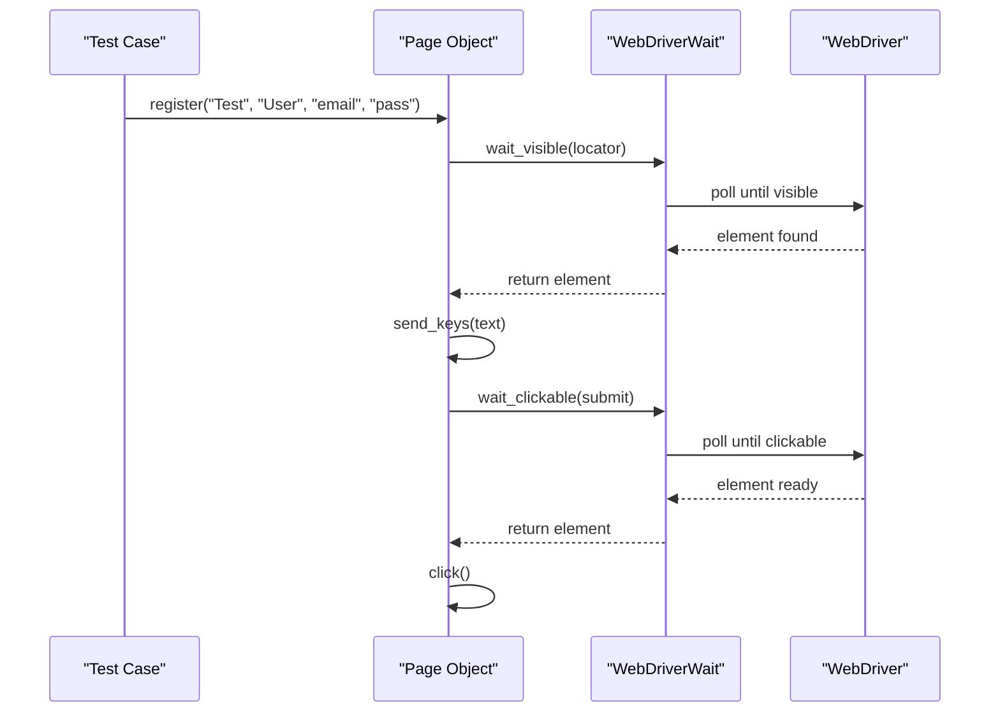
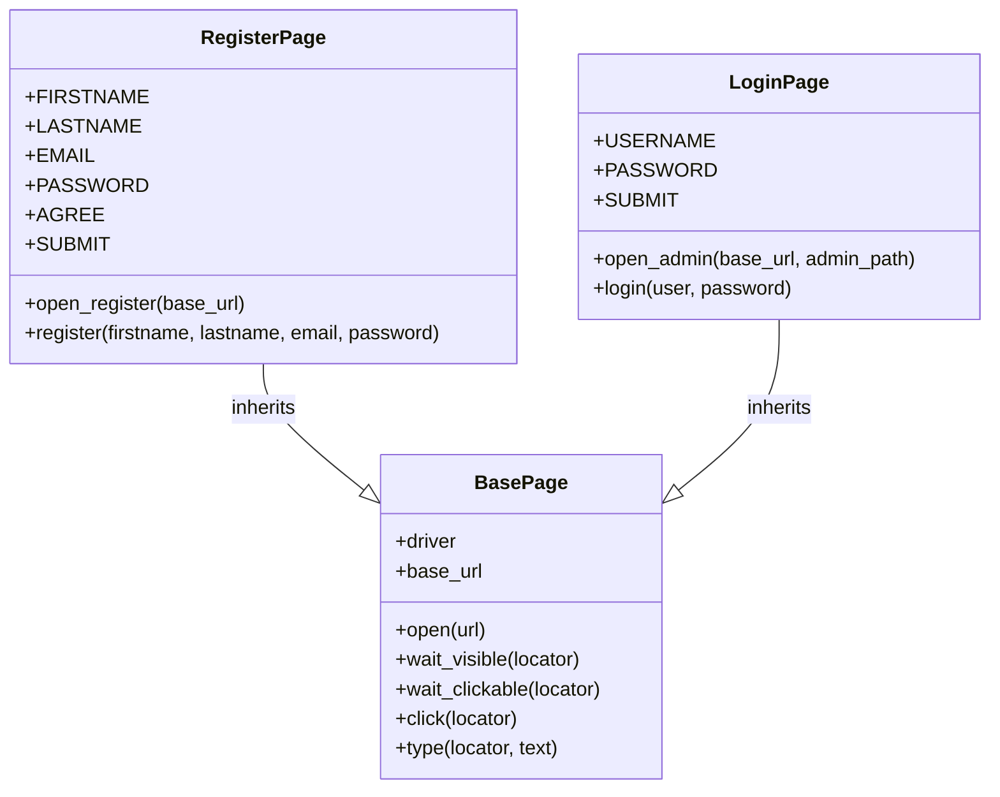
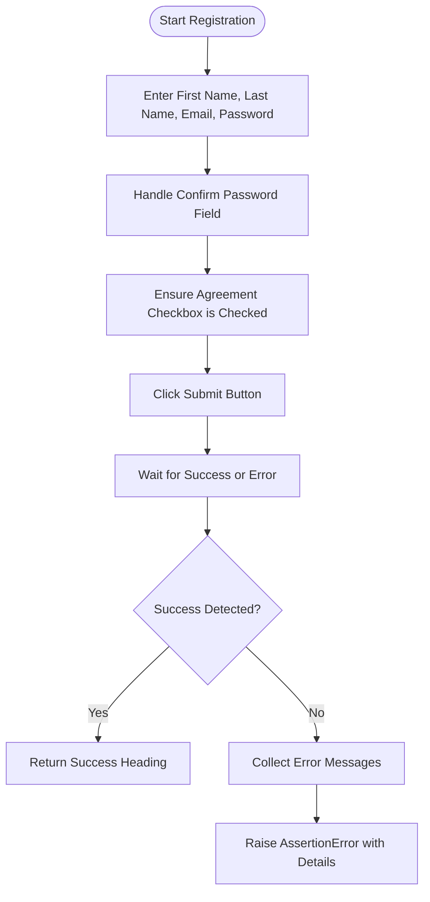

# Best Practices

<cite>
**Referenced Files in This Document**   
- [base.py](file://pages/base.py)
- [waits.py](file://utils/waits.py)
- [register_page.py](file://pages/register_page.py)
- [login_page.py](file://pages/login_page.py)
- [test_register_page.py](file://tests/test_register_page.py)
- [test_register_po.py](file://tests/test_register_po.py)
</cite>

## Table of Contents
1. [Introduction](#introduction)
2. [Locator Strategy Selection](#locator-strategy-selection)
3. [Explicit Waits and Element Synchronization](#explicit-waits-and-element-synchronization)
4. [Page Object Design Principles](#page-object-design-principles)
5. [Handling Complex Forms with Conditional Logic](#handling-complex-forms-with-conditional-logic)
6. [Performance Optimization Techniques](#performance-optimization-techniques)
7. [Error Handling and Debugging Strategies](#error-handling-and-debugging-strategies)
8. [Reducing Test Flakiness and Ensuring Reliability](#reducing-test-flakiness-and-ensuring-reliability)
9. [Conclusion](#conclusion)

## Introduction
This document outlines best practices for maintaining and extending the test automation framework used in the OpenCart project. It focuses on robust test design, efficient element interaction, and reliable execution patterns. The guidance is derived from analysis of the existing codebase, including page objects, utility functions, and test implementations. These practices aim to improve test stability, readability, and maintainability across the suite.

## Locator Strategy Selection
The framework prioritizes CSS selectors and data attributes over XPath for element location. This approach enhances readability, performance, and resilience to DOM changes. For example, in `register_page.py`, locators such as `#input-firstname` and `#input-email` use CSS ID selectors, which are fast and unambiguous. Similarly, `login_page.py` uses `(By.ID, "input-username")`, demonstrating a preference for stable, semantic identifiers.

When IDs are not available, class-based CSS selectors are used with specificity (e.g., `.nav-tabs`, `.product-thumb`). The use of XPath is limited to cases where dynamic text matching is required, such as in `currency_dropdown.py`, where `//a[contains(normalize-space(.), '{currency_name}')]` is used to select currency options by visible text. However, even in such cases, consider using data attributes (e.g., `data-currency="USD"`) to enable simpler CSS selection and reduce XPath complexity.

**Section sources**
- [register_page.py](file://pages/register_page.py#L5-L15)
- [login_page.py](file://pages/login_page.py#L5-L7)
- [currency_dropdown.py](file://pages/components/currency_dropdown.py#L7)

## Explicit Waits and Element Synchronization
The framework employs explicit waits to ensure element visibility and interactivity before interaction. The `utils/waits.py` module provides reusable wait functions such as `wait_element`, `wait_all`, and `wait_title`, which wrap Selenium’s `WebDriverWait` and `expected_conditions`. These functions include built-in failure handling: upon timeout, a screenshot is captured and an assertion error is raised with descriptive messaging.

In page objects, waiting is encapsulated within methods like `wait_visible` and `wait_clickable` defined in `base.py`. This abstraction ensures consistent synchronization logic across all page classes. For instance, the `type` method in `BasePage` first waits for visibility before sending keys, preventing race conditions.

Tests using the procedural style (e.g., `test_register_page.py`) directly call `wait_element`, while page-object-based tests (e.g., `test_product_page_po.py`) rely on the page’s internal wait mechanisms, promoting separation of concerns.

**Diagram sources**
- [utils/waits.py](file://utils/waits.py#L5-L28)
- [base.py](file://pages/base.py#L15-L34)

**Section sources**
- [utils/waits.py](file://utils/waits.py#L5-L28)
- [base.py](file://pages/base.py#L15-L34)
- [test_register_page.py](file://tests/test_register_page.py#L5-L10)

## Page Object Design Principles
The framework adheres to key page object principles: single responsibility, method cohesion, and separation of test logic from page logic. Each page class (e.g., `RegisterPage`, `LoginPage`) represents a single screen or component and exposes methods that reflect user actions (e.g., `login`, `register`).

Methods within page objects are cohesive and focused. For example, `register` in `RegisterPage` performs a complete registration flow but delegates lower-level actions like typing and clicking to inherited methods from `BasePage`. This prevents duplication and ensures consistency.

Crucially, test logic such as assertions and conditional branching is kept out of page classes. The `register` method returns the success heading element upon completion but does not assert its text—this is handled in the test (`test_register_po.py`). This separation allows page objects to be reused across multiple test scenarios with different expectations.

**Diagram sources**
- [base.py](file://pages/base.py#L5-L34)
- [register_page.py](file://pages/register_page.py#L1-L15)
- [login_page.py](file://pages/login_page.py#L1-L7)

**Section sources**
- [register_page.py](file://pages/register_page.py#L1-L100)
- [login_page.py](file://pages/login_page.py#L1-L14)
- [test_register_po.py](file://tests/test_register_po.py#L10-L13)

## Handling Complex Forms with Conditional Logic
The `register_page.py` file exemplifies how to handle complex forms with conditional elements. The `_type_confirm_password` method attempts multiple locators (`#input-confirm`, `name="confirm"`) and falls back to selecting the second password field if explicit locators fail. This resilience ensures the test can adapt to minor UI variations.

Similarly, `_ensure_agree_checked` handles the agreement checkbox through multiple strategies: direct click, label click via JavaScript, and scroll-into-view to ensure visibility. This layered approach increases reliability in dynamic environments.

The `_wait_success_or_errors` method uses a custom wait condition to detect registration outcome, combining URL, title, and element text checks. This flexibility allows the test to pass even if the success indicator varies slightly.

**Diagram sources**
- [register_page.py](file://pages/register_page.py#L25-L95)

**Section sources**
- [register_page.py](file://pages/register_page.py#L25-L99)

## Performance Optimization Techniques
The framework optimizes performance through efficient element location and browser reuse. By using precise CSS selectors and avoiding expensive XPath expressions, element lookup time is minimized. The use of explicit waits with reasonable timeouts (7–10 seconds) prevents unnecessary delays while ensuring stability.

Browser reuse is managed via pytest fixtures (e.g., `browser`, `wait`), which are defined in `conftest.py` (not analyzed here but inferred from usage). This avoids the overhead of launching a new browser for each test.

Additionally, the `BasePage.click` method includes a fallback to JavaScript clicking if a normal click fails, reducing flakiness without requiring longer waits or retries.

**Section sources**
- [base.py](file://pages/base.py#L25-L34)
- [utils/waits.py](file://utils/waits.py#L5-L28)

## Error Handling and Debugging Strategies
The framework includes robust error handling with built-in debugging support. The `wait_element` function in `utils/waits.py` automatically captures a screenshot on timeout, saving it with the session ID as the filename. This enables quick visual diagnosis of test failures.

Assertions are used to provide clear, actionable error messages. For example, `wait_title` includes both expected and actual titles in the failure message, making it easy to identify mismatches.

In `register_page.py`, the `register` method collects all visible error messages from common error containers (`.text-danger`, `.alert-danger`, etc.) and includes them in the assertion, giving comprehensive feedback when registration fails.

**Section sources**
- [utils/waits.py](file://utils/waits.py#L5-L28)
- [register_page.py](file://pages/register_page.py#L85-L99)

## Reducing Test Flakiness and Ensuring Reliability
To reduce flakiness, the framework combines multiple reliability techniques: explicit waits, retry mechanisms, scroll-into-view, and JavaScript fallbacks. The `click` method in `BasePage` attempts a normal click first, then scrolls the element into view and uses JavaScript if needed.

Tests are designed to be independent and idempotent. For example, `test_register_po.py` generates a unique email using a timestamp, ensuring each run uses fresh data and avoids conflicts.

Page objects encapsulate complex interactions, reducing duplication and ensuring consistent behavior across tests. This modularity makes it easier to update locators or logic in one place when the UI changes.

**Section sources**
- [base.py](file://pages/base.py#L25-L34)
- [register_page.py](file://pages/register_page.py#L50-L75)
- [test_register_po.py](file://tests/test_register_po.py#L5-L13)

## Conclusion
The test automation framework demonstrates strong adherence to best practices in locator strategy, synchronization, page object design, and error handling. By prioritizing CSS selectors, encapsulating waits, and separating test logic from page logic, the framework achieves a high degree of reliability and maintainability. The use of debugging aids like screenshots and detailed error messages further enhances test observability. Following these practices ensures that the test suite remains robust and scalable as the application evolves.