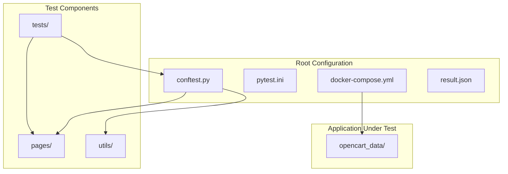
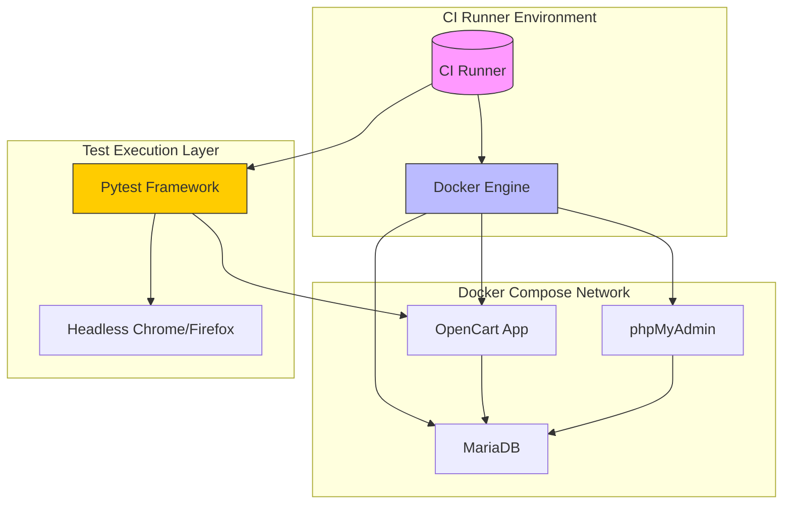
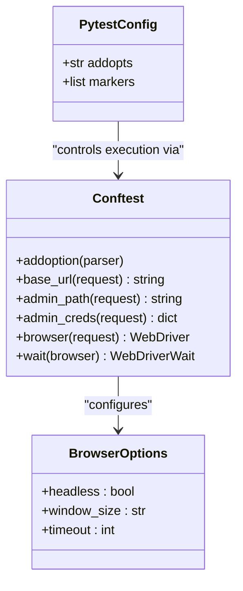
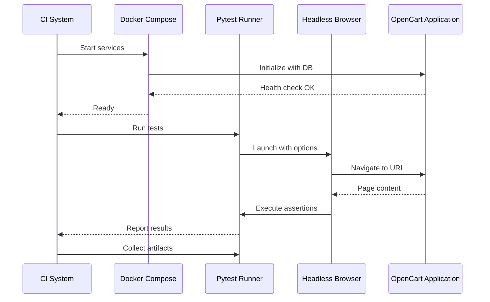
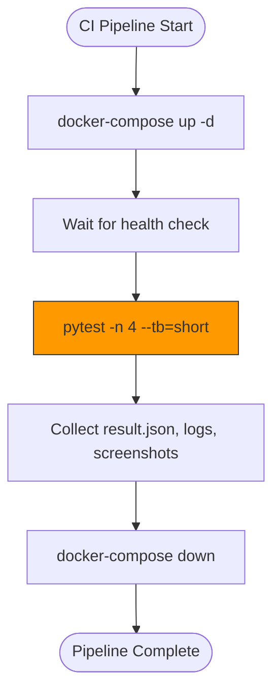

# CI/CD Integration

<cite>
**Referenced Files in This Document**   
- [docker-compose.yml](file://docker-compose.yml)
- [pytest.ini](file://pytest.ini)
- [conftest.py](file://conftest.py)
- [test_scenarios.py](file://tests/test_scenarios.py)
- [result.json](file://result.json)
</cite>

## Table of Contents
1. [Introduction](#introduction)
2. [Project Structure](#project-structure)
3. [Core Components](#core-components)
4. [Architecture Overview](#architecture-overview)
5. [Detailed Component Analysis](#detailed-component-analysis)
6. [Dependency Analysis](#dependency-analysis)
7. [Performance Considerations](#performance-considerations)
8. [Troubleshooting Guide](#troubleshooting-guide)
9. [Conclusion](#conclusion)

## Introduction
This document provides architectural documentation for integrating the test automation framework into CI/CD pipelines. It explains how containerization ensures consistent test execution across environments, how test configuration is standardized, and outlines best practices for parallel execution, result aggregation, and failure reporting. The system leverages Docker Compose to replicate the application environment, pytest for test orchestration, and supports integration with major CI platforms.

## Project Structure
The project follows a modular structure with clear separation between test logic, page objects, utilities, and infrastructure configuration. The root-level configuration files enable containerized execution and standardized test behavior.



**Diagram sources**
- [docker-compose.yml](file://docker-compose.yml#L1-L44)
- [pytest.ini](file://pytest.ini#L1-L5)

**Section sources**
- [docker-compose.yml](file://docker-compose.yml#L1-L44)
- [pytest.ini](file://pytest.ini#L1-L5)
- [conftest.py](file://conftest.py#L1-L81)

## Core Components
The core components include the Docker Compose setup for environment consistency, pytest configuration for test behavior control, and fixture-based browser management. These components work together to ensure reliable and repeatable test execution in both local and CI environments.

**Section sources**
- [docker-compose.yml](file://docker-compose.yml#L1-L44)
- [pytest.ini](file://pytest.ini#L1-L5)
- [conftest.py](file://conftest.py#L1-L81)

## Architecture Overview
The architecture uses containerization to encapsulate the OpenCart application and its dependencies (database, phpMyAdmin), while test scripts run in a separate environment with access to the application endpoint. This decoupling allows tests to be executed in any environment where Docker is available, ensuring consistency from development to CI runners.



**Diagram sources**
- [docker-compose.yml](file://docker-compose.yml#L1-L44)
- [conftest.py](file://conftest.py#L1-L81)

## Detailed Component Analysis

### Test Configuration and Execution
The framework uses pytest with custom configuration and fixtures to manage test execution parameters, browser instantiation, and application state.

#### Configuration Management


**Diagram sources**
- [pytest.ini](file://pytest.ini#L1-L5)
- [conftest.py](file://conftest.py#L1-L81)

#### Test Execution Flow


**Diagram sources**
- [docker-compose.yml](file://docker-compose.yml#L1-L44)
- [conftest.py](file://conftest.py#L1-L81)
- [test_scenarios.py](file://tests/test_scenarios.py#L1-L330)

### Parallel Test Execution Strategy
The framework supports parallel execution through pytest-xdist (not explicitly configured but compatible). Tests can be distributed across multiple workers by adding `-n auto` to pytest commands. The stateless nature of most tests allows safe parallelization, while admin-marked tests requiring login can be grouped.



**Diagram sources**
- [docker-compose.yml](file://docker-compose.yml#L1-L44)
- [pytest.ini](file://pytest.ini#L1-L5)

## Dependency Analysis
The system has a clear dependency hierarchy with minimal coupling between components. The test framework depends on the application being available at a known endpoint, while the application stack is self-contained within Docker Compose.

```mermaid
graph TD
pytest_ini --> conftest : "defines execution options"
conftest --> selenium : "uses WebDriver"
conftest --> tests : "provides fixtures"
tests --> pages : "uses page objects"
docker_compose --> opencart_data : "mounts configuration"
opencart_data --> opencart : "provides config.php"
opencart --> mariadb : "database connection"
phpmyadmin --> mariadb : "database access"
class pytest_ini,conftest,tests,pages,utils,opencart_data,Dockerfile,requirements.txt fileIcon;
```

**Diagram sources**
- [docker-compose.yml](file://docker-compose.yml#L1-L44)
- [pytest.ini](file://pytest.ini#L1-L5)
- [conftest.py](file://conftest.py#L1-L81)
- [opencart_data/config.php](file://opencart_data/config.php#L1-L31)

**Section sources**
- [docker-compose.yml](file://docker-compose.yml#L1-L44)
- [pytest.ini](file://pytest.ini#L1-L5)
- [conftest.py](file://conftest.py#L1-L81)

## Performance Considerations
Running headless browsers in containers requires careful resource allocation. Chrome in headless mode typically consumes 300-500MB RAM per instance. For parallel execution, CI runners should have at least 2GB RAM per browser instance. The current configuration uses implicit waits of 2 seconds and page load timeout of 30 seconds, which balances speed and reliability.

When executing in CI, it's recommended to:
- Use `--headless` flag to reduce resource consumption
- Limit parallel workers based on available CPU and memory
- Use lightweight base images for test containers
- Cache Docker layers to speed up pipeline execution

**Section sources**
- [conftest.py](file://conftest.py#L1-L81)

## Troubleshooting Guide
Common issues and their solutions:

| Issue | Cause | Solution |
|-------|-------|----------|
| Connection refused to localhost:8081 | Services not ready | Wait for health check completion before starting tests |
| Element not interactable | Page not fully loaded | Increase implicit wait or use explicit waits |
| Test flakiness | Dynamic content loading | Implement retry logic for critical operations |
| Missing admin credentials | Environment variables not set | Set OC_ADMIN_USER and OC_ADMIN_PASS in CI |
| Database connection errors | Service startup race condition | Add delay or check MariaDB readiness |

Artifacts should be collected on failure:
- `result.json`: Test results in JSON format
- Console logs from test execution
- Screenshots on test failure (currently not implemented but can be added)
- Docker container logs via `docker-compose logs`

**Section sources**
- [docker-compose.yml](file://docker-compose.yml#L1-L44)
- [conftest.py](file://conftest.py#L1-L81)
- [result.json](file://result.json)

## Conclusion
The test framework is well-structured for CI/CD integration, leveraging Docker Compose for environment consistency and pytest for flexible test execution. The configuration enables reliable test runs across different environments, from local development to CI runners. By following the outlined practices for parallel execution, artifact collection, and resource management, teams can achieve fast and reliable automated testing as part of their delivery pipeline.