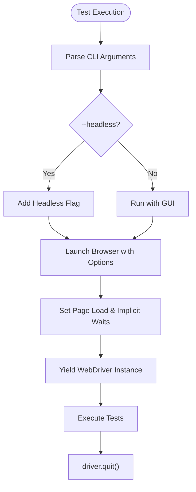
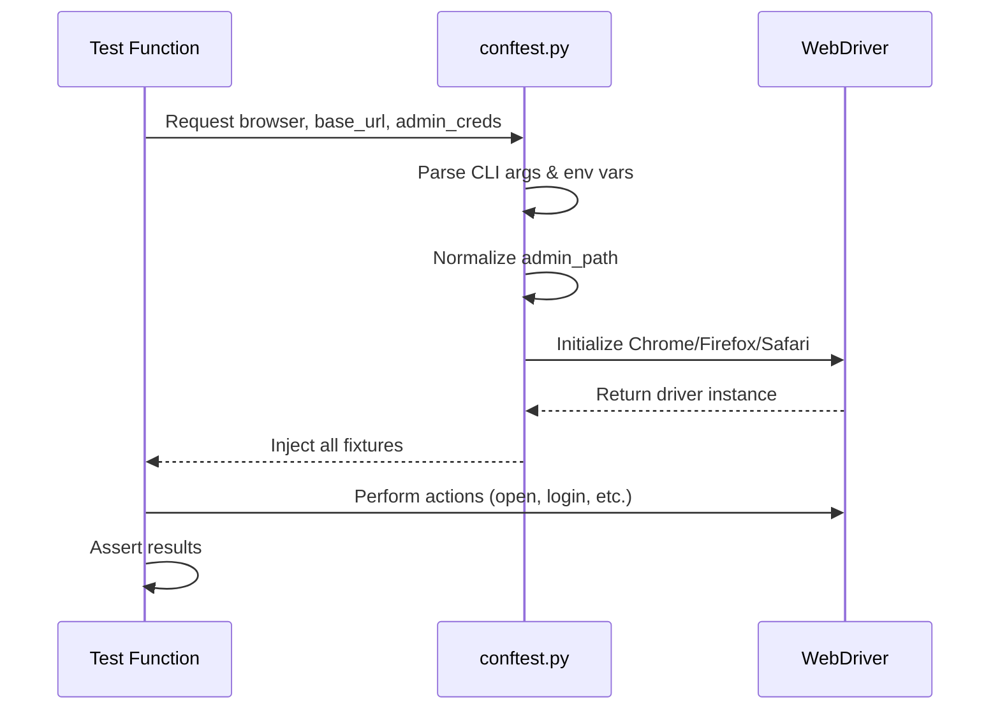

# Configuration Guide

<cite>
**Referenced Files in This Document**   
- [conftest.py](file://conftest.py)
- [pytest.ini](file://pytest.ini)
- [pages/admin/admin_login_page.py](file://pages/admin/admin_login_page.py)
- [pages/login_page.py](file://pages/login_page.py)
- [tests/test_admin_login_po.py](file://tests/test_admin_login_po.py)
- [utils/waits.py](file://utils/waits.py)
</cite>

## Table of Contents
1. [CLI Configuration Options](#cli-configuration-options)
2. [Environment Variables for Secure Credentials](#environment-variables-for-secure-credentials)
3. [Configuration Precedence Rules](#configuration-precedence-rules)
4. [Test Environment Configuration Examples](#test-environment-configuration-examples)
5. [Customizing Browser and Timeout Settings](#customizing-browser-and-timeout-settings)
6. [Configuration Injection via Pytest Fixtures](#configuration-injection-via-pytest-fixtures)

## CLI Configuration Options

The test framework supports several command-line interface (CLI) arguments defined in `conftest.py` through the `pytest_addoption` hook. These options allow flexible configuration of test execution parameters without modifying code.

The supported CLI arguments include:

- `--browser`: Specifies the browser to use for testing. Accepts values: `chrome`, `firefox`, or `safari`. Default is `chrome`.
- `--base-url`: Sets the base URL of the OpenCart application under test. Default value is `https://demo.opencart.com`.
- `--admin-path`: Defines the path to the admin login page (e.g., `/administration` or `/admin`). Default is `/administration`.
- `--headless`: A flag that, when present, runs the browser in headless mode (without GUI). Disabled by default.

These options are registered with pytest and can be used directly when invoking test runs.

**Section sources**
- [conftest.py](file://conftest.py#L5-L24)

## Environment Variables for Secure Credentials

To securely manage sensitive data such as admin credentials, the framework uses environment variables instead of hardcoding values. The following environment variables are supported:

- `OC_ADMIN_USER`: Stores the admin username.
- `OC_ADMIN_PASS`: Stores the admin password.

In `conftest.py`, these environment variables are accessed using `os.getenv()` within the default values for the corresponding CLI options (`--admin-username` and `--admin-password`). This ensures that if the CLI arguments are not explicitly provided, the system attempts to retrieve the values from the environment. If neither the CLI argument nor the environment variable is set, an empty string is used, which may lead to test skipping when credentials are required.

This approach prevents credential leakage into logs or version control while allowing seamless integration with CI/CD pipelines where secrets are injected as environment variables.

**Section sources**
- [conftest.py](file://conftest.py#L14-L17)

## Configuration Precedence Rules

The configuration system follows a clear precedence hierarchy to resolve settings:

1. **Command-line arguments take highest precedence** — If a user specifies a value via CLI (e.g., `--base-url=http://staging.opencart.local`), it overrides any environment variable or default value.
2. **Environment variables are used if CLI options are absent** — For credentials, if `--admin-username` is not passed, the value from `OC_ADMIN_USER` is used.
3. **Default values apply only when neither CLI nor environment variables are provided** — For example, `--browser` defaults to `chrome`, and `--base-url` defaults to `https://demo.opencart.com`.

This layered approach ensures flexibility across different environments while maintaining security and ease of use.

**Section sources**
- [conftest.py](file://conftest.py#L9-L17)

## Test Environment Configuration Examples

Below are typical command-line configurations for various test environments:

### Local Development (Chrome, GUI Mode)
```bash
pytest tests/test_admin_login_po.py --browser=chrome --base-url=http://localhost:8081 --admin-path=/administration --admin-username=admin --admin-password=password123
```

### Staging Environment (Firefox, Headless)
```bash
pytest tests/test_admin_products_po.py --browser=firefox --base-url=https://staging.opencart.org --admin-path=/admin --headless
```

### CI Pipeline Execution (Using Environment Variables)
```bash
# Environment variables set externally:
# export OC_ADMIN_USER=admin
# export OC_ADMIN_PASS=$SECRET_ADMIN_PASS

pytest tests/test_admin_login_po.py --browser=chrome --base-url=https://demo.opencart.com --admin-path=/administration --headless
```

These examples demonstrate how the same test suite can be executed across different environments by adjusting configuration inputs without changing test code.

**Section sources**
- [conftest.py](file://conftest.py#L5-L24)
- [tests/test_admin_login_po.py](file://tests/test_admin_login_po.py#L5-L19)

## Customizing Browser and Timeout Settings

The framework configures browser behavior and timeout settings programmatically within the `browser` fixture in `conftest.py`.

### Window Size
- Chrome: Set via `--window-size=1280,900` argument.
- Firefox: Applied using `driver.set_window_size(1280, 900)` after initialization.
- Safari: Uses default window size (no customization implemented).

### Timeouts
- **Page Load Timeout**: Set to 30 seconds using `driver.set_page_load_timeout(30)`.
- **Implicit Wait**: Set to 2 seconds using `driver.implicitly_wait(2)`, enabling dynamic element discovery.
- **Explicit Wait**: A separate `wait` fixture provides a `WebDriverWait` instance with a 10-second timeout, intended for conditional waits on specific elements.

Headless mode is enabled conditionally based on the `--headless` flag:
- Chrome uses `--headless=new` flag.
- Firefox uses `-headless` argument.

These defaults balance performance and reliability but can be extended if needed.



**Diagram sources**
- [conftest.py](file://conftest.py#L45-L78)

**Section sources**
- [conftest.py](file://conftest.py#L45-L78)
- [utils/waits.py](file://utils/waits.py#L5-L10)

## Configuration Injection via Pytest Fixtures

Configuration values are injected into test sessions using pytest fixtures, which provide a clean and reusable way to share setup logic.

Key fixtures defined in `conftest.py` include:

- `base_url`: Returns the trimmed base URL from `--base-url`, ensuring no trailing slash.
- `admin_path`: Normalizes the admin path to always start with `/`.
- `admin_creds`: Returns a dictionary containing `user` and `password` retrieved from CLI or environment variables.
- `browser`: Initializes and yields a WebDriver instance based on selected browser and options.
- `wait`: Provides a WebDriverWait instance with a 10-second timeout for explicit waits.

Tests access these configurations by declaring fixture names as parameters. For example, `test_admin_login_po` uses `browser`, `base_url`, `admin_path`, and `admin_creds` to perform login validation.

When credentials are missing, tests use `pytest.skip()` to gracefully skip execution, preventing false failures due to misconfiguration.



**Diagram sources**
- [conftest.py](file://conftest.py#L25-L79)
- [tests/test_admin_login_po.py](file://tests/test_admin_login_po.py#L5-L19)

**Section sources**
- [conftest.py](file://conftest.py#L25-L79)
- [tests/test_admin_login_po.py](file://tests/test_admin_login_po.py#L5-L19)