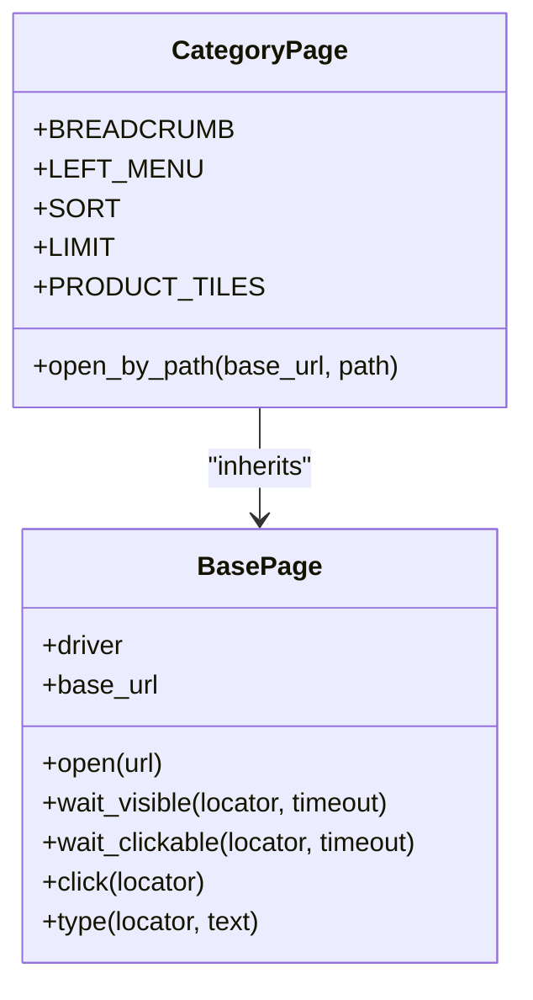
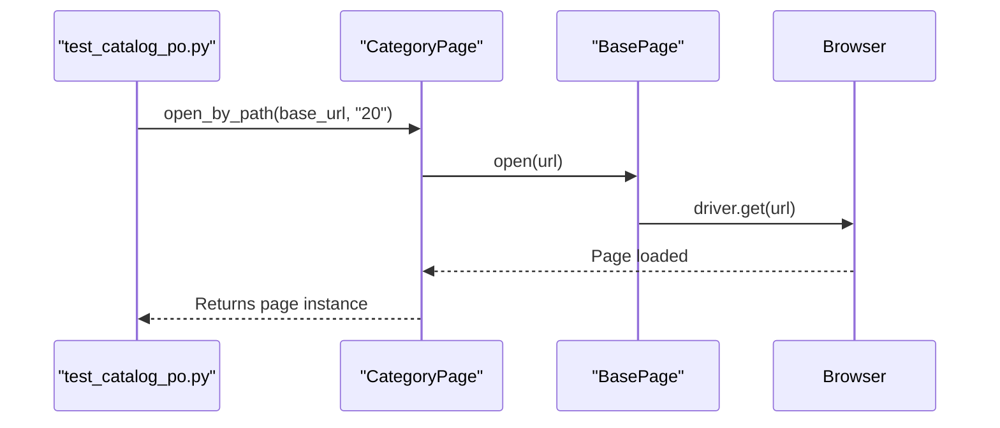
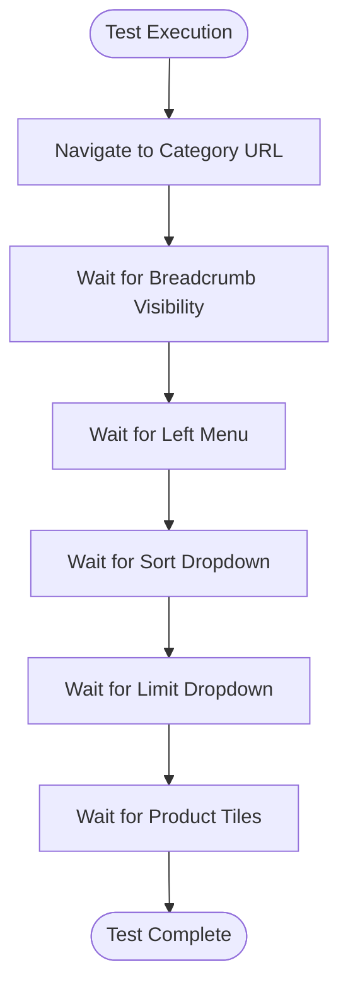

# Category Page

<cite>
**Referenced Files in This Document**   
- [category_page.py](file://pages/category_page.py)
- [base.py](file://pages/base.py)
- [test_catalog_po.py](file://tests/test_catalog_po.py)
- [waits.py](file://utils/waits.py)
</cite>

## Table of Contents
1. [Introduction](#introduction)
2. [Core Components](#core-components)
3. [Architecture Overview](#architecture-overview)
4. [Detailed Component Analysis](#detailed-component-analysis)
5. [Dependency Analysis](#dependency-analysis)
6. [Performance Considerations](#performance-considerations)
7. [Troubleshooting Guide](#troubleshooting-guide)
8. [Conclusion](#conclusion)

## Introduction
The `CategoryPage` class is responsible for managing interactions on product category pages within an OpenCart-based e-commerce application. It enables automated testing of category browsing functionality, including loading category listings, verifying UI elements, and preparing for navigation to individual product pages. This document details its implementation, usage in tests, and best practices for maintenance.

## Core Components

The `CategoryPage` class extends `BasePage` to inherit core page interaction methods such as element waiting and clicking. It defines static locators for key UI components on category pages and provides a method to open a specific category by path. The class is used in page-object-style tests to ensure reliable and readable automation.

**Section sources**
- [category_page.py](file://pages/category_page.py#L1-L14)
- [base.py](file://pages/base.py#L1-L35)

## Architecture Overview



**Diagram sources**
- [base.py](file://pages/base.py#L1-L35)
- [category_page.py](file://pages/category_page.py#L1-L14)

## Detailed Component Analysis

### CategoryPage Class Analysis

The `CategoryPage` encapsulates the structure and behavior of OpenCart category pages. It uses CSS selector-based locators to identify stable UI elements such as the breadcrumb trail, left navigation menu, sort and limit dropdowns, and product tiles.

#### Locator Definitions
The class defines the following locators:
- **BREADCRUMB**: Targets the navigation breadcrumb using `.breadcrumb`
- **LEFT_MENU**: Locates the category sidebar menu via `.list-group`
- **SORT**: Identifies the sorting dropdown with `#input-sort`
- **LIMIT**: Finds the items-per-page selector using `#input-limit`
- **PRODUCT_TILES**: Captures all product grid items using a compound selector `.product-layout, .product-thumb`

These locators are designed to be resilient to dynamic content loading, as they target structural elements that are typically present after AJAX calls complete.

#### open_by_path Method
This method constructs a URL using the provided base URL and category path (defaulting to "20") and navigates to it using the inherited `open()` method. It enables test scripts to directly access any category without hardcoding full URLs.



**Diagram sources**
- [category_page.py](file://pages/category_page.py#L12-L14)
- [base.py](file://pages/base.py#L8-L10)

#### Integration with Waits
The `CategoryPage` relies on the `wait_visible()` method from `BasePage`, which uses Selenium’s `WebDriverWait` and `EC.visibility_of_element_located` to handle AJAX-loaded content. This ensures that tests do not proceed until elements are fully rendered and visible, reducing flakiness.

In `test_catalog_po.py`, each major UI component is verified using `wait_visible()` with the corresponding class-level locator, confirming that the page has loaded correctly.



**Diagram sources**
- [test_catalog_po.py](file://tests/test_catalog_po.py#L3-L8)
- [base.py](file://pages/base.py#L11-L14)

**Section sources**
- [category_page.py](file://pages/category_page.py#L1-L14)
- [test_catalog_po.py](file://tests/test_catalog_po.py#L1-L8)
- [base.py](file://pages/base.py#L11-L14)

## Dependency Analysis

The `CategoryPage` depends on the `BasePage` for core browser interaction capabilities. It also indirectly relies on Selenium’s WebDriverWait and Expected Conditions via the `wait_visible` method. The test file `test_catalog_po.py` directly imports and uses `CategoryPage`, demonstrating its role in the test automation framework.

```mermaid
graph TD
A[test_catalog_po.py] --> B[CategoryPage]
B --> C[BasePage]
C --> D[Selenium WebDriverWait]
C --> E[ExpectedConditions]
B --> F[By (Selenium)]
```

**Diagram sources**
- [test_catalog_po.py](file://tests/test_catalog_po.py#L1-L8)
- [category_page.py](file://pages/category_page.py#L1-L14)
- [base.py](file://pages/base.py#L1-L35)

**Section sources**
- [category_page.py](file://pages/category_page.py#L1-L14)
- [base.py](file://pages/base.py#L1-L35)
- [test_catalog_po.py](file://tests/test_catalog_po.py#L1-L8)

## Performance Considerations

The `CategoryPage` design supports efficient handling of dynamic content through explicit waits rather than fixed delays. The default timeout of 10 seconds in `wait_visible()` balances responsiveness with reliability. However, in cases of slow server response or heavy client-side rendering, increasing the timeout may be necessary to avoid false failures.

The use of compound selectors like `.product-layout, .product-thumb` allows flexibility in matching different layout types but may slightly impact selector resolution time. This is negligible in practice due to modern browser engine optimizations.

## Troubleshooting Guide

Common issues when using `CategoryPage` include:
- **Stale Element Reference**: Occurs when the DOM changes after element lookup. Mitigated by re-locating elements within retry logic or using fresh page instances.
- **Timeout Errors**: Indicate missing or delayed elements. The framework captures screenshots on failure (via `utils.waits`), aiding in root cause analysis.
- **Locator Breakage**: Changes in OpenCart templates (e.g., class name updates) require updating the corresponding locator constants in `CategoryPage`. To minimize maintenance:
  - Use stable, semantic CSS classes or IDs
  - Avoid overly specific selectors
  - Document assumptions about template structure
  - Implement a review process for template changes

When OpenCart templates change, update locators in `CategoryPage` and verify all related tests. Consider using data attributes (e.g., `data-test="breadcrumb"`) in templates to create stable, test-specific hooks.

**Section sources**
- [category_page.py](file://pages/category_page.py#L1-L14)
- [waits.py](file://utils/waits.py#L1-L28)
- [test_catalog_po.py](file://tests/test_catalog_po.py#L1-L8)

## Conclusion

The `CategoryPage` class provides a robust, maintainable interface for testing product category functionality in OpenCart. By leveraging inheritance, explicit waits, and clear locator strategies, it ensures reliable automation. Its integration with the page object pattern enhances test readability and reduces duplication. Proper handling of dynamic content and thoughtful design make it a critical component of the test suite.