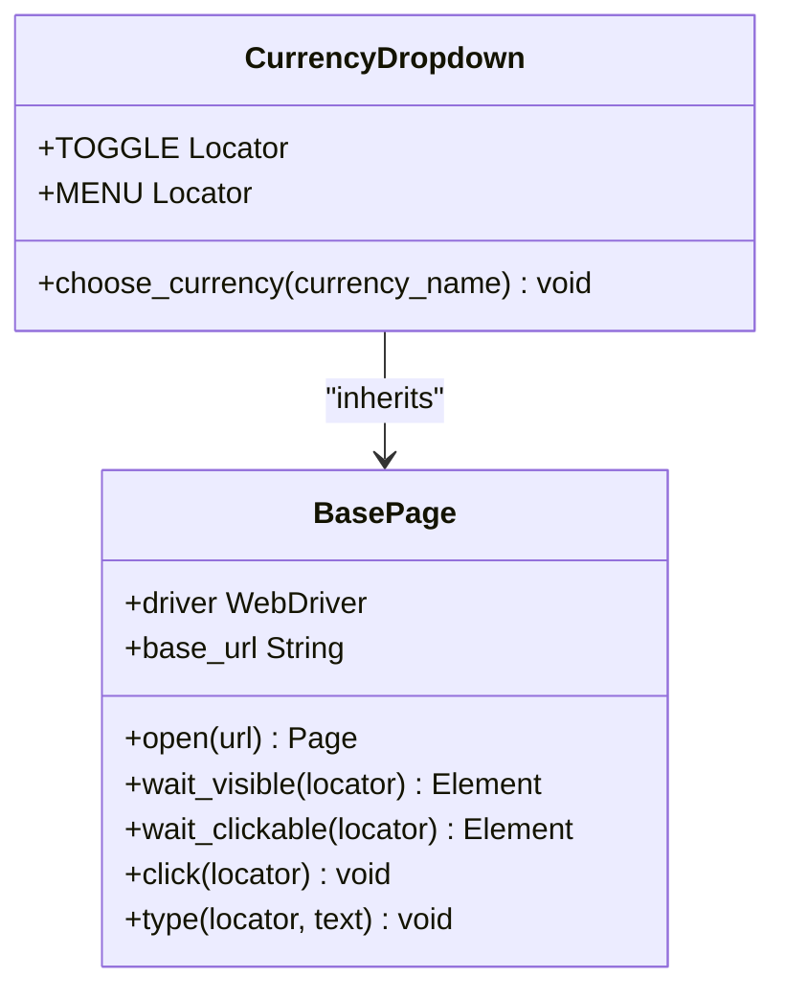
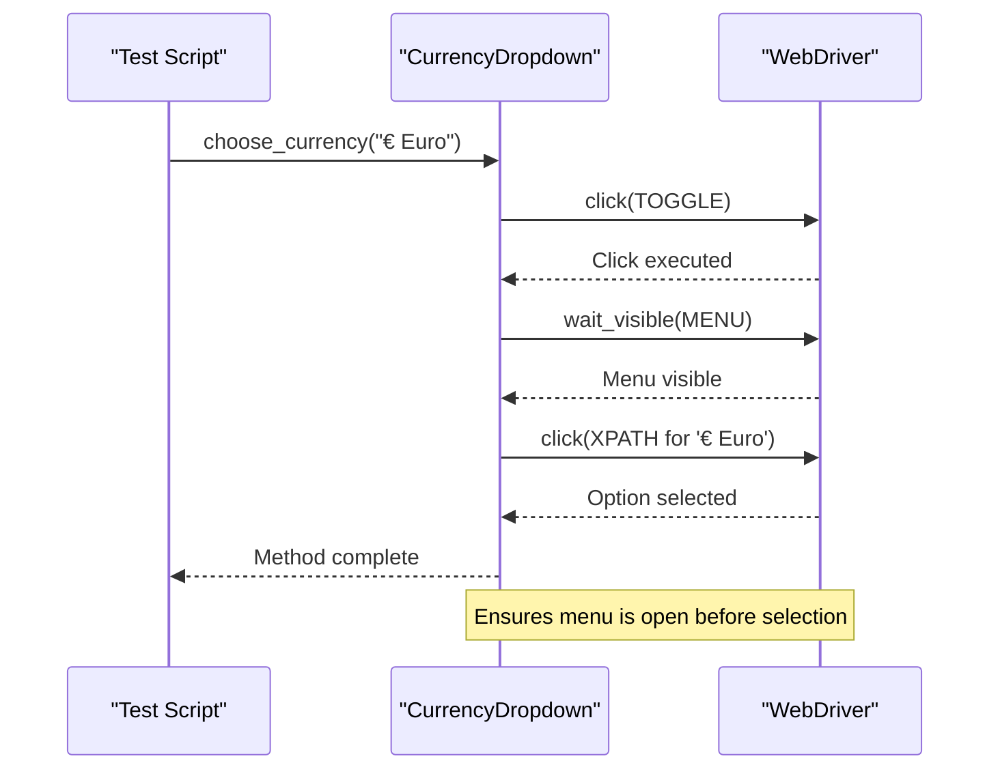
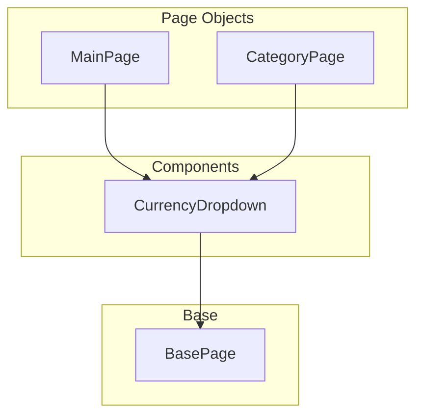
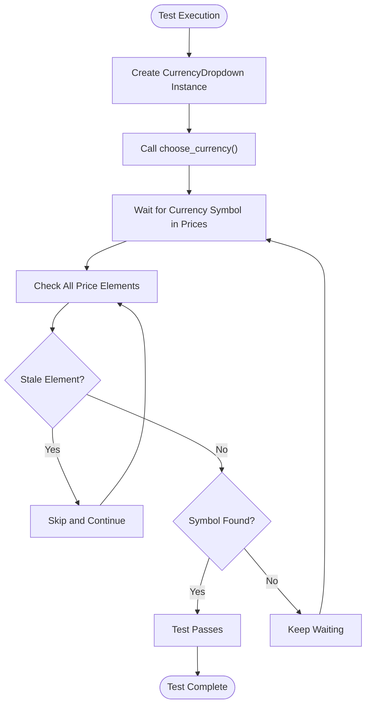

# Currency Dropdown Component

<cite>
**Referenced Files in This Document**   
- [currency_dropdown.py](file://pages/components/currency_dropdown.py)
- [base.py](file://pages/base.py)
- [test_currency_po.py](file://tests/test_currency_po.py)
- [main_page.py](file://pages/main_page.py)
</cite>

## Table of Contents
1. [Introduction](#introduction)
2. [Component Architecture](#component-architecture)
3. [Core Methods and Interaction Patterns](#core-methods-and-interaction-patterns)
4. [Integration with Page Objects](#integration-with-page-objects)
5. [Locator Strategy and Dynamic Content Handling](#locator-strategy-and-dynamic-content-handling)
6. [Test Implementation and Assertion Logic](#test-implementation-and-assertion-logic)
7. [Reusability and Adaptation Guidelines](#reusability-and-adaptation-guidelines)
8. [Conclusion](#conclusion)

## Introduction
The CurrencyDropdown component is a reusable UI element designed to manage currency selection on the OpenCart storefront. It encapsulates the logic for interacting with the currency switcher dropdown, enabling consistent and reliable behavior across different page objects. This document details its implementation, integration, testing, and extension strategies.

**Section sources**
- [currency_dropdown.py](file://pages/components/currency_dropdown.py#L1-L11)
- [test_currency_po.py](file://tests/test_currency_po.py#L1-L25)

## Component Architecture
The CurrencyDropdown class is implemented as a standalone component under the `pages/components/` directory, inheriting from `BasePage`. This design promotes reusability and separation of concerns by isolating currency-specific interactions from individual page logic.

It defines two primary locators:
- **TOGGLE**: Identifies the dropdown toggle button using CSS selector `#form-currency .dropdown-toggle`
- **MENU**: Locates the dropdown menu container via `#form-currency .dropdown-menu`

By extending `BasePage`, it inherits essential WebDriver interaction methods such as `click()`, `wait_visible()`, and `wait_clickable()`, ensuring consistent wait and interaction behavior.



**Diagram sources**
- [currency_dropdown.py](file://pages/components/currency_dropdown.py#L3-L11)
- [base.py](file://pages/base.py#L1-L35)

**Section sources**
- [currency_dropdown.py](file://pages/components/currency_dropdown.py#L1-L11)
- [base.py](file://pages/base.py#L1-L35)

## Core Methods and Interaction Patterns
The `choose_currency(currency_name)` method orchestrates the complete interaction flow:
1. Clicks the dropdown toggle to open the menu
2. Waits for the dropdown menu to become visible
3. Clicks the option matching the provided currency name using dynamic XPath

This method abstracts the complexity of handling dynamic content updates and synchronization, providing a clean interface for currency selection.



**Diagram sources**
- [currency_dropdown.py](file://pages/components/currency_dropdown.py#L8-L11)
- [base.py](file://pages/base.py#L20-L30)

**Section sources**
- [currency_dropdown.py](file://pages/components/currency_dropdown.py#L8-L11)

## Integration with Page Objects
The CurrencyDropdown component can be instantiated independently and used within any page context. For example, in `MainPage`, it can be integrated without requiring inheritance or direct coupling.

To use it within a page object like `MainPage`, simply instantiate the `CurrencyDropdown` class with the shared WebDriver instance:
```python
dropdown = CurrencyDropdown(driver)
dropdown.choose_currency("£ Pound Sterling")
```

This composition-based approach allows flexible reuse across `MainPage`, `CategoryPage`, or any other page without duplicating logic.



**Diagram sources**
- [main_page.py](file://pages/main_page.py#L1-L12)
- [currency_dropdown.py](file://pages/components/currency_dropdown.py#L1-L11)

**Section sources**
- [main_page.py](file://pages/main_page.py#L1-L12)
- [currency_dropdown.py](file://pages/components/currency_dropdown.py#L1-L11)

## Locator Strategy and Dynamic Content Handling
The component uses a hybrid locator strategy:
- **Static CSS Selectors**: For stable elements like the toggle and menu container
- **Dynamic XPath**: For selecting currency options based on text content

The XPath expression `//form[@id='form-currency']//a[contains(normalize-space(.), '{currency_name}')]` ensures robust matching even when whitespace varies. The use of `normalize-space()` eliminates issues from extra spaces or line breaks in the DOM text.

Synchronization is handled through explicit waits:
- `wait_visible(self.MENU)` ensures the dropdown has fully opened before attempting selection
- Inherited `wait_clickable()` logic automatically retries clicks if elements are not immediately interactable

This approach prevents race conditions when the UI updates asynchronously after currency selection.

**Section sources**
- [currency_dropdown.py](file://pages/components/currency_dropdown.py#L6-L11)
- [base.py](file://pages/base.py#L15-L30)

## Test Implementation and Assertion Logic
The `test_currency_po.py` file demonstrates how to validate currency switching functionality. It uses parameterized testing to verify multiple currency options.

Key aspects of the test:
- Uses `CurrencyDropdown` directly with the browser driver
- Calls `choose_currency()` with formatted names (e.g., "€ Euro")
- Implements a custom expected condition (`has_symbol`) that checks product prices for the expected currency symbol
- Handles `StaleElementReferenceException` during price verification due to dynamic DOM updates
- Uses WebDriverWait to poll until the new currency is reflected in the UI

This pattern ensures that the test waits for actual visual confirmation of the change rather than just completing the click action.



**Diagram sources**
- [test_currency_po.py](file://tests/test_currency_po.py#L1-L25)

**Section sources**
- [test_currency_po.py](file://tests/test_currency_po.py#L1-L25)

## Reusability and Adaptation Guidelines
To reuse the CurrencyDropdown component in new page objects:
1. Import the class: `from pages.components.currency_dropdown import CurrencyDropdown`
2. Instantiate with the current driver: `dropdown = CurrencyDropdown(driver)`
3. Call `choose_currency()` with the desired currency name

For stores with custom currency selectors:
- Override the `TOGGLE` and `MENU` locators in a subclass
- Modify the XPath expression in `choose_currency()` if the structure differs
- Consider adding a method like `get_available_currencies()` if dynamic discovery is needed

For multi-language support:
- Use language-agnostic symbols (€, £, $) in assertions
- Map display names to symbols in test data
- Ensure test configurations provide correct currency_name values based on locale

This component can also be extended to support additional features like:
- Getting the currently selected currency
- Verifying available options
- Waiting for price updates post-selection

**Section sources**
- [currency_dropdown.py](file://pages/components/currency_dropdown.py#L1-L11)
- [test_currency_po.py](file://tests/test_currency_po.py#L1-L25)

## Conclusion
The CurrencyDropdown component exemplifies effective encapsulation and reuse in page object design. By isolating currency selection logic into a dedicated class, it promotes maintainability, consistency, and test reliability. Its integration with the base page functionality and clear interaction patterns make it a robust solution for managing dynamic UI elements in OpenCart storefront testing.