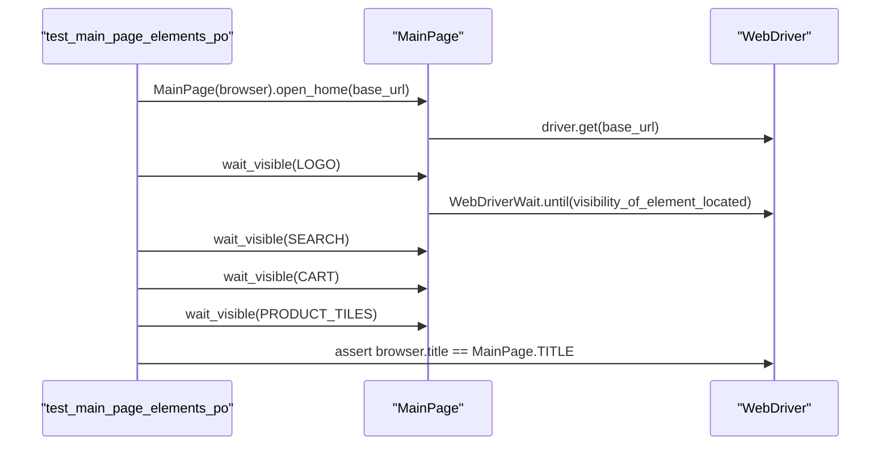

# Main Page

<cite>
**Referenced Files in This Document**  
- [main_page.py](file://pages/main_page.py)
- [base.py](file://pages/base.py)
- [test_main_page_po.py](file://tests/test_main_page_po.py)
</cite>

## Table of Contents
1. [Introduction](#introduction)
2. [MainPage Class Overview](#mainpage-class-overview)
3. [Inheritance from BasePage](#inheritance-from-basepage)
4. [Key Locators and Locator Strategies](#key-locators-and-locator-strategies)
5. [Core Methods](#core-methods)
6. [Test Integration Example](#test-integration-example)
7. [Extensibility and Customization](#extensibility-and-customization)
8. [Common Issues and Best Practices](#common-issues-and-best-practices)

## Introduction
The `MainPage` class represents the homepage of the OpenCart e-commerce platform within the Page Object Model (POM) design pattern. It encapsulates the structure and behavior of the main landing page, enabling reliable and maintainable test automation. This document details the implementation of the `MainPage` class, its interaction with core UI elements, and its integration into automated test scenarios.

## MainPage Class Overview

The `MainPage` class serves as a page object abstraction for the OpenCart homepage. It defines static locators for key UI components and provides methods to interact with them in a structured and reusable manner. By leveraging the Page Object Model, `MainPage` enhances test readability, reduces code duplication, and isolates changes in the UI from test logic.

Key responsibilities of the `MainPage` class include:
- Verifying the presence of essential UI elements
- Navigating to the homepage
- Interacting with top-menu components such as the shopping cart and search bar
- Supporting navigation to login and registration pages through UI interactions

**Section sources**
- [main_page.py](file://pages/main_page.py#L1-L11)

## Inheritance from BasePage

The `MainPage` class inherits from the `BasePage` class, which provides foundational methods for browser interaction and element handling. This inheritance enables consistent and robust element interaction across all page objects in the framework.

The `BasePage` class includes the following core capabilities:
- **`open(url)`**: Navigates to a specified URL
- **`wait_visible(locator)`**: Waits for an element to become visible
- **`wait_clickable(locator)`**: Waits for an element to become clickable
- **`click(locator)`**: Clicks an element, with fallback scroll-and-click logic for obscured elements
- **`type(locator, text)`**: Enters text into an input field after clearing it

By extending `BasePage`, `MainPage` gains access to these utilities without duplicating implementation logic, promoting consistency and reducing maintenance overhead.

```mermaid
classDiagram
class BasePage {
+driver
+base_url
+open(url)
+wait_visible(locator, timeout)
+wait_clickable(locator, timeout)
+click(locator)
+type(locator, text)
}
class MainPage {
+TITLE
+LOGO
+SEARCH
+CART
+PRODUCT_TILES
+open_home(base_url)
}
MainPage --|> BasePage : Inherits
note right of MainPage
Encapsulates OpenCart homepage elements
Uses CSS selectors for robust element location
end note
```

**Diagram sources**
- [main_page.py](file://pages/main_page.py#L1-L11)
- [base.py](file://pages/base.py#L1-L34)

**Section sources**
- [base.py](file://pages/base.py#L1-L34)

## Key Locators and Locator Strategies

The `MainPage` class defines several class-level constants that represent locators for critical UI elements. These locators use CSS selector strategies to ensure reliable identification of elements, even in dynamic environments.

| Locator | Strategy | Description |
|--------|---------|-------------|
| `TITLE` | String Constant | Expected page title ("Your Store") used for verification |
| `LOGO` | CSS Selector | Selector `#logo` targets the site logo element |
| `SEARCH` | CSS Selector | Selector `input[name='search']` identifies the search input field |
| `CART` | Composite CSS Selector | Combines multiple selectors to locate the cart element across language variants and layout changes |
| `PRODUCT_TILES` | CSS Selector | Matches product grid items using `.product-thumb` or `.product-layout` classes |

The use of composite selectors (e.g., for `CART`) ensures resilience against UI changes, such as localization (e.g., "Shopping Cart" vs. "Корзина") or theme variations. This strategy increases test stability by allowing multiple valid paths to the same functional element.

**Section sources**
- [main_page.py](file://pages/main_page.py#L5-L10)

## Core Methods

### open_home(base_url)
This method navigates the browser to the OpenCart homepage using the provided base URL. It delegates to the inherited `open()` method from `BasePage` and returns the instance for method chaining.

```python
def open_home(self, base_url):
    return self.open(base_url)
```

This method serves as the primary entry point for tests interacting with the main page, ensuring consistent navigation logic across test cases.

**Section sources**
- [main_page.py](file://pages/main_page.py#L12-L13)

## Test Integration Example

The `test_main_page_elements_po.py` file demonstrates how tests interact with the `MainPage` class using the Page Object Model. The test verifies that key elements are present and visible on the homepage.



**Diagram sources**
- [test_main_page_po.py](file://tests/test_main_page_po.py#L1-L8)
- [main_page.py](file://pages/main_page.py#L1-L11)

**Section sources**
- [test_main_page_po.py](file://tests/test_main_page_po.py#L1-L8)

## Extensibility and Customization

The `MainPage` class can be extended to support custom themes or dynamic content such as banners. For example:

```python
class CustomMainPage(MainPage):
    BANNER_CLOSE = (By.CSS_SELECTOR, ".banner .close")

    def close_banner(self):
        if self.is_element_present(self.BANNER_CLOSE):
            self.click(self.BANNER_CLOSE)
        return self
```

When extending `MainPage`, consider:
- Adding new locators for theme-specific elements
- Overriding methods to handle dynamic content (e.g., pop-ups, banners)
- Using conditional waits for elements that appear based on user state or configuration

This extensibility allows teams to maintain a shared base implementation while accommodating site-specific variations.

## Common Issues and Best Practices

### Element Visibility Delays
Dynamic content loading may cause elements to appear after the page load event. Always use explicit waits (e.g., `wait_visible`) rather than fixed delays to handle timing variability.

### Resolution-Specific Layout Changes
Responsive designs may alter element visibility or structure at different screen sizes. Consider:
- Testing across multiple viewport sizes
- Using robust locators that work in both desktop and mobile layouts
- Avoiding reliance on element position or visibility assumptions

### Best Practices
- Use composite selectors for critical navigation elements to handle localization
- Leverage inheritance to avoid duplicating wait and interaction logic
- Keep page objects focused on a single page’s functionality
- Verify page state (e.g., title) after navigation to confirm correct loading

**Section sources**
- [main_page.py](file://pages/main_page.py#L1-L11)
- [base.py](file://pages/base.py#L1-L34)
- [test_main_page_po.py](file://tests/test_main_page_po.py#L1-L8)