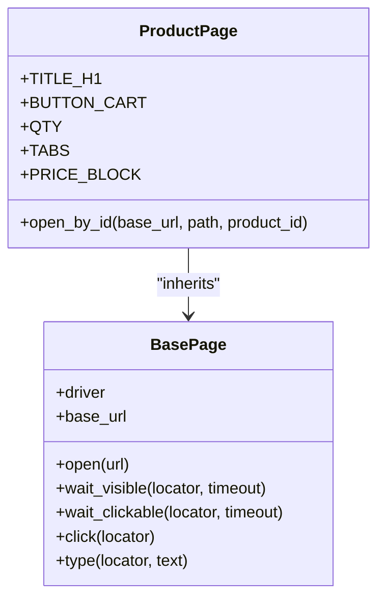
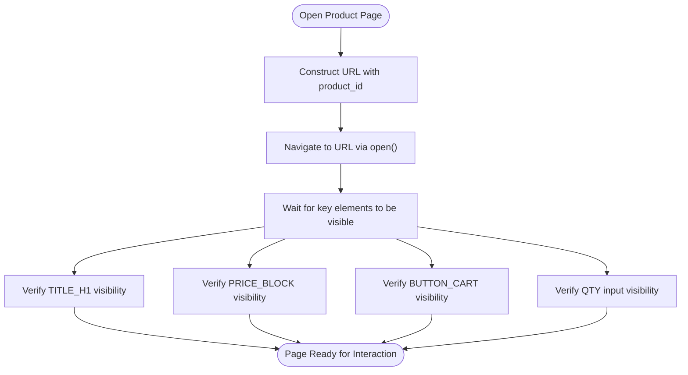
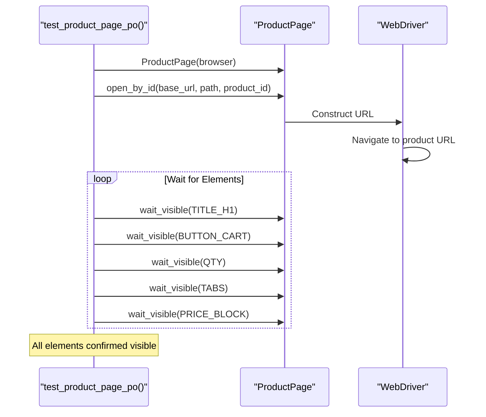
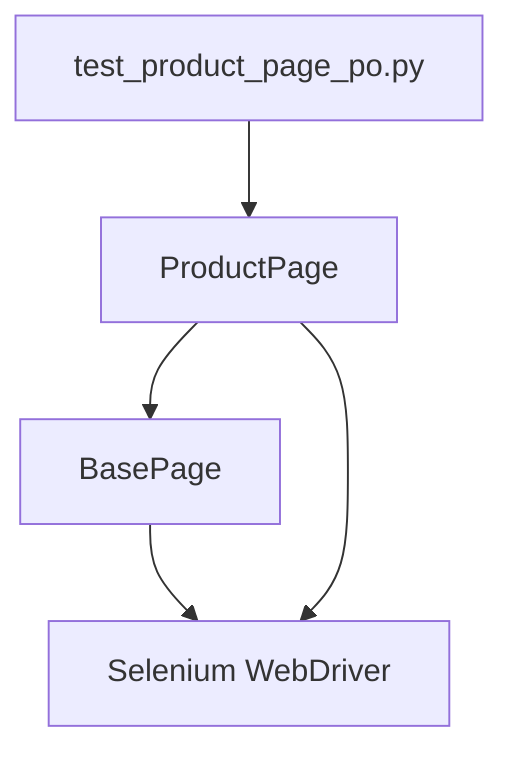

# Product Page

<cite>
**Referenced Files in This Document**   
- [product_page.py](file://pages/product_page.py)
- [base.py](file://pages/base.py)
- [test_product_page_po.py](file://tests/test_product_page_po.py)
</cite>

## Table of Contents
1. [Introduction](#introduction)
2. [Core Components](#core-components)
3. [Architecture Overview](#architecture-overview)
4. [Detailed Component Analysis](#detailed-component-analysis)
5. [Dependency Analysis](#dependency-analysis)
6. [Performance Considerations](#performance-considerations)
7. [Troubleshooting Guide](#troubleshooting-guide)
8. [Conclusion](#conclusion)

## Introduction
The ProductPage class is a Page Object Model (POM) implementation responsible for managing interactions on product detail pages within an OpenCart-based e-commerce application. It enables automated retrieval of product information, selection of variants and quantities, and execution of cart operations. Built on top of the BasePage class, it leverages shared browser interaction utilities while encapsulating product-specific locators and behaviors. This document details its structure, functionality, and usage patterns based on test cases and implementation logic.

## Core Components

The ProductPage class defines key locators for essential UI elements such as the product title, price block, quantity input, add-to-cart button, and navigation tabs. It provides a method to open a specific product by ID and inherits robust interaction methods from BasePage, including visibility waits, clicking, and typing. These components work together to support reliable end-to-end testing of product page workflows.

**Section sources**
- [product_page.py](file://pages/product_page.py#L1-L14)
- [base.py](file://pages/base.py#L1-L36)

## Architecture Overview

The ProductPage follows the Page Object Model design pattern, promoting reusability and maintainability in test automation. It inherits core browser interaction capabilities from BasePage, which handles low-level Selenium operations with built-in resilience like smart scrolling on click failures. This layered architecture separates page structure definition from test logic, enabling clean, readable, and maintainable test scripts.

**Diagram sources**
- [base.py](file://pages/base.py#L1-L36)
- [product_page.py](file://pages/product_page.py#L1-L14)

## Detailed Component Analysis

### ProductPage Class Analysis
The ProductPage class encapsulates the structure and behavior of the product detail page. It defines static locators for critical elements using CSS selectors, allowing consistent access across test cases. The `open_by_id` method constructs a URL using route parameters and delegates navigation to the inherited `open` method, enabling direct access to any product.

#### Locator Strategy for Dynamic Elements
The class employs a flexible CSS selector strategy to handle variations in product page rendering:
- **PRICE_BLOCK** uses a compound selector to match price elements across different themes or layouts
- Other locators target stable DOM attributes like IDs and class names
- All locators are defined as class-level tuples compatible with Selenium’s By mechanism

This approach ensures resilience against minor UI changes while maintaining precise element targeting.

**Diagram sources**
- [product_page.py](file://pages/product_page.py#L6-L14)

#### Smart Scrolling and Element Interaction
Inherited from BasePage, the `click` method includes a fallback mechanism: if a standard click fails (e.g., due to element occlusion), it executes JavaScript to scroll the element into view and performs a programmatic click. This ensures reliable interaction even when elements are outside the viewport, a common issue in dynamic web applications.

**Section sources**
- [product_page.py](file://pages/product_page.py#L1-L14)
- [base.py](file://pages/base.py#L1-L36)

### Test Case Integration
The `test_product_page_po.py` file demonstrates the usage of ProductPage in end-to-end tests. It verifies that all major components of the product page—title, price, cart button, quantity field, and tabs—are present and visible after loading. This serves as a foundational smoke test for product page integrity.

**Diagram sources**
- [test_product_page_po.py](file://tests/test_product_page_po.py#L1-L10)
- [product_page.py](file://pages/product_page.py#L1-L14)

## Dependency Analysis

The ProductPage class depends directly on the BasePage class for core browser automation functionality. It uses Selenium’s By and expected_conditions modules through inheritance and direct reference. The test file depends on ProductPage to instantiate and interact with the page, forming a clear dependency chain from test to page object to base utilities.

**Diagram sources**
- [product_page.py](file://pages/product_page.py#L1-L14)
- [base.py](file://pages/base.py#L1-L36)
- [test_product_page_po.py](file://tests/test_product_page_po.py#L1-L10)

**Section sources**
- [product_page.py](file://pages/product_page.py#L1-L14)
- [base.py](file://pages/base.py#L1-L36)
- [test_product_page_po.py](file://tests/test_product_page_po.py#L1-L10)

## Performance Considerations

The implementation uses explicit waits (`wait_visible`, `wait_clickable`) rather than fixed delays, improving test efficiency and reliability. The smart click mechanism reduces flakiness caused by layout shifts or lazy-loaded content, minimizing retry overhead. Locator strategies are optimized for performance using ID and class selectors, which are faster than XPath or complex CSS traversals.

## Troubleshooting Guide

Common issues when using ProductPage include missing add-to-cart buttons, incorrect pricing display, or stale element references. These can be diagnosed by:
- Verifying the correct product ID is used in `open_by_id`
- Checking network requests for failed asset or API calls
- Ensuring the browser window size does not cause responsive hiding of elements
- Confirming that the PRICE_BLOCK selector matches the actual DOM structure

When elements are not found, inspect the page HTML to validate locator accuracy and consider updating selectors to accommodate UI changes.

**Section sources**
- [product_page.py](file://pages/product_page.py#L6-L14)
- [base.py](file://pages/base.py#L20-L30)

## Conclusion

The ProductPage class provides a robust, reusable interface for automating product detail page interactions. Its design leverages inheritance, resilient locators, and smart interaction patterns to ensure stable test execution. Integrated with test cases that validate core functionality, it forms a critical component of the test automation framework for e-commerce features.