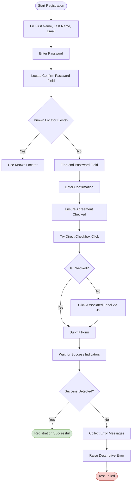
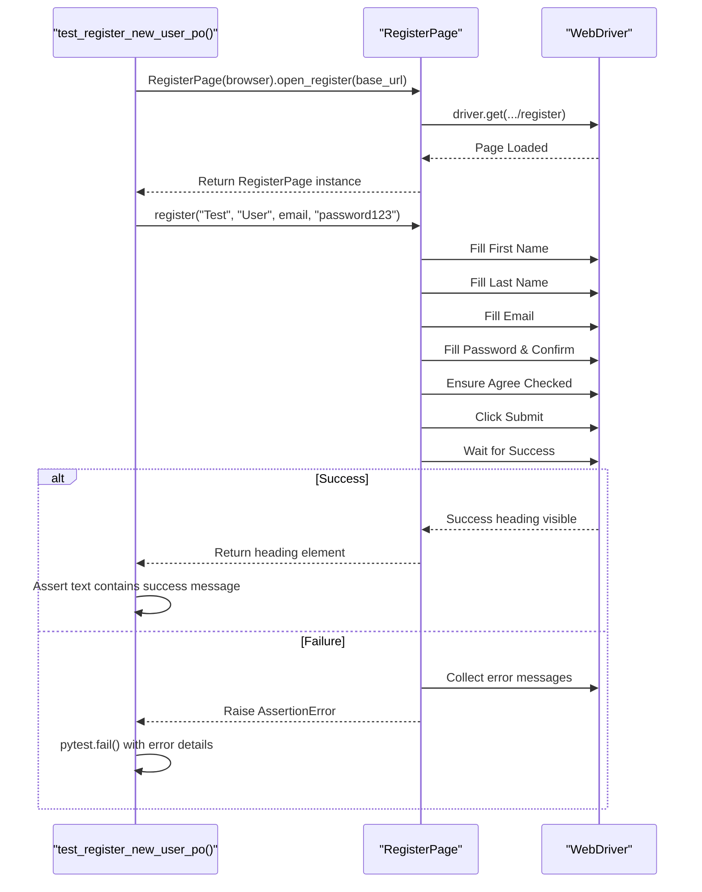

# Register Page

<cite>
**Referenced Files in This Document**   
- [register_page.py](file://pages/register_page.py)
- [test_register_po.py](file://tests/test_register_po.py)
- [base.py](file://pages/base.py)
</cite>

## Table of Contents
1. [Introduction](#introduction)
2. [Core Components](#core-components)
3. [Registration Workflow](#registration-workflow)
4. [Handling Dynamic Elements](#handling-dynamic-elements)
5. [Test Implementation and Flows](#test-implementation-and-flows)
6. [Best Practices for Test Data Management](#best-practices-for-test-data-management)
7. [Troubleshooting Common Issues](#troubleshooting-common-issues)
8. [Conclusion](#conclusion)

## Introduction
The `RegisterPage` class is responsible for managing the user registration process in the OpenCart application. It encapsulates interactions with form fields such as personal information, password inputs, and consent checkboxes. Built on top of the `BasePage` class, it leverages shared page interaction methods while implementing specialized logic for handling dynamic UI elements and validation outcomes. This document details its structure, usage in test automation, and best practices for reliable testing.

## Core Components

The `RegisterPage` class defines locators for all key elements on the registration form and provides high-level methods to interact with them. It inherits essential browser interaction utilities from `BasePage`, including element waiting, clicking, and typing functionality.

Key fields include:
- **FIRSTNAME**: Locator for the first name input field
- **LASTNAME**: Locator for the last name input field
- **EMAIL**: Locator for the email address field
- **PASSWORD**: Locator for the password field
- **AGREE**: Checkbox for agreeing to terms and conditions
- **SUBMIT**: Submit button to finalize registration
- **SUCCESS_HEADING**: Confirmation heading displayed upon successful registration

The primary method `register()` orchestrates the complete registration flow by filling out required fields, ensuring agreement is accepted, and submitting the form. It also includes robust error detection by scanning common error message containers.

**Section sources**
- [register_page.py](file://pages/register_page.py#L5-L98)
- [base.py](file://pages/base.py#L4-L34)

## Registration Workflow

The `register()` method performs a sequence of actions to simulate a real user registering an account:
1. Fills in first name, last name, and email
2. Optionally fills telephone (if present)
3. Enters password and confirms it using `_type_confirm_password()`
4. Ensures the agreement checkbox is checked via `_ensure_agree_checked()`
5. Submits the form
6. Waits for success indicators or collects error messages

Success is determined through multiple criteria:
- URL contains "success"
- Page title or success heading contains "Your Account Has Been Created"

If success conditions are not met, the method gathers text from common error element classes (`.text-danger`, `.alert-danger`, etc.) and raises a descriptive `AssertionError`.

The `open_register()` method navigates to the registration page using a base URL provided during test setup.

**Section sources**
- [register_page.py](file://pages/register_page.py#L74-L98)

## Handling Dynamic Elements

Dynamic elements such as the agreement checkbox are handled with resilient strategies to ensure test stability across different rendering conditions.

### Conditional Checkbox Handling
The `_ensure_agree_checked()` method attempts multiple approaches:
1. Direct click on the checkbox input using the `click()` method from `BasePage`
2. If the direct click fails (e.g., due to overlay or visibility issues), it locates the associated label and triggers a JavaScript click

This fallback mechanism ensures compatibility even when the checkbox is hidden or obscured by other elements.

### Flexible Password Confirmation
The `_type_confirm_password()` method supports variable form layouts:
- First tries known locators (`#input-confirm`, `name=confirm`)
- If those fail, detects second password-type input field on the page
- Uses JavaScript fallbacks if standard interactions fail

This flexibility allows the test to work across different versions or themes of OpenCart where field IDs may vary.

**Diagram sources**
- [register_page.py](file://pages/register_page.py#L35-L72)

## Test Implementation and Flows

The `test_register_po.py` file demonstrates how to use the `RegisterPage` class in end-to-end tests.

### Valid Registration Flow
The `test_register_new_user_po` function:
1. Generates a unique email using a timestamp
2. Opens the registration page
3. Calls `register()` with test data
4. Validates that the success message appears

This ensures that new user registration works correctly and prevents duplicate account creation.

### Error Case Validation
Although not explicitly shown in the current test, the `register()` method’s design supports error case validation. For example, attempting to register with an existing email should trigger error detection logic and raise an `AssertionError`, which can be caught and verified in negative test cases.

**Diagram sources**
- [test_register_po.py](file://tests/test_register_po.py#L0-L12)
- [register_page.py](file://pages/register_page.py#L74-L98)

## Best Practices for Test Data Management

### Unique Email Generation
The test uses `f"user_{int(time.time())}@mail.com"` to generate time-based unique emails. This prevents conflicts from duplicate registrations and supports repeatable testing.

Alternative strategies could include:
- UUID-based emails: `f"user_{uuid.uuid4()}@mail.com"`
- Counter-based emails using shared state or database
- Disposable email services for real-world validation

### Test User Lifecycle
Since OpenCart does not provide a built-in API to delete test users, consider:
- Running tests in isolated environments that can be reset
- Using a cleanup script that logs into admin panel and deletes test users
- Limiting test runs to non-production environments only

### Data Isolation
Each test should use independent data to avoid interference. Avoid hardcoding emails or usernames that could cause flakiness across test runs.

**Section sources**
- [test_register_po.py](file://tests/test_register_po.py#L0-L12)

## Troubleshooting Common Issues

### CAPTCHA Interference
If CAPTCHA appears on the registration form:
- Disable CAPTCHA in test environment settings
- Use browser profiles with CAPTCHA bypass extensions (for internal testing only)
- Implement waits for manual CAPTCHA solving in development mode

### JavaScript-Driven Form Validation
Some themes use JavaScript to validate fields dynamically:
- Ensure all required fields are filled, even if optional in UI
- Trigger blur events after typing: `driver.execute_script("arguments[0].blur()", element)`
- Wait for validation indicators before submission

### Element Interaction Failures
Common causes and solutions:
- **Element not clickable**: Use JavaScript click fallbacks (already implemented)
- **Stale elements**: Re-locate elements after navigation
- **Visibility issues**: Scroll into view before interaction
- **Timing issues**: Increase timeout in `wait_visible` or `wait_clickable`

### Test Flakiness
To improve reliability:
- Add explicit waits after navigation
- Use unique, non-repeating test data
- Run tests in headless mode with consistent viewport
- Isolate tests so they don’t depend on each other

**Section sources**
- [register_page.py](file://pages/register_page.py#L35-L72)
- [base.py](file://pages/base.py#L4-L34)

## Conclusion
The `RegisterPage` class provides a robust, reusable interface for automating user registration in OpenCart. Its design emphasizes resilience through fallback mechanisms for dynamic elements and comprehensive error detection. When combined with proper test data management and environment configuration, it enables reliable automated testing of both success and error scenarios. Future enhancements could include support for marketing consent toggles and integration with admin APIs for test cleanup.