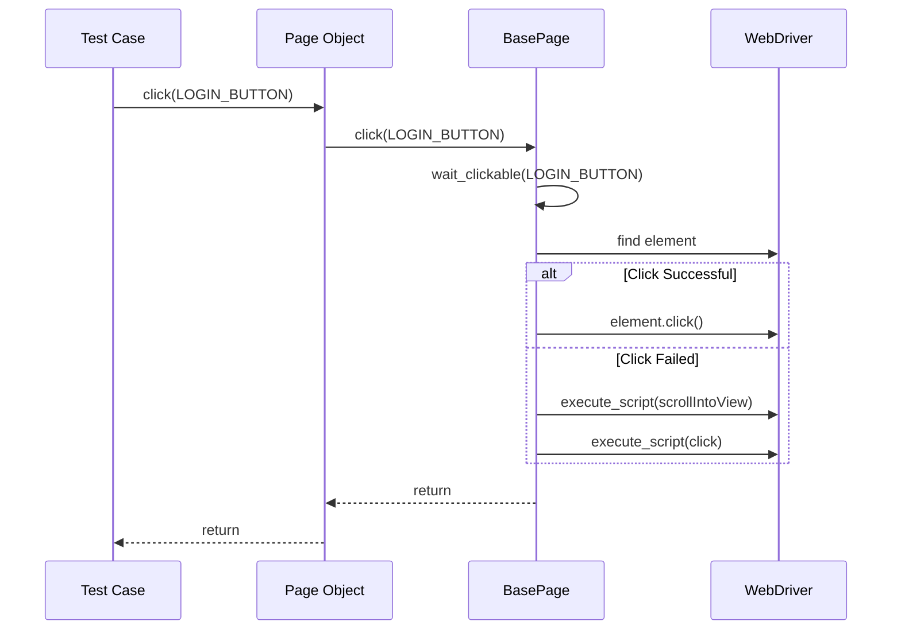
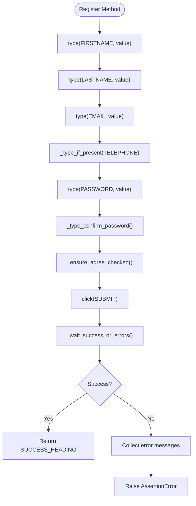
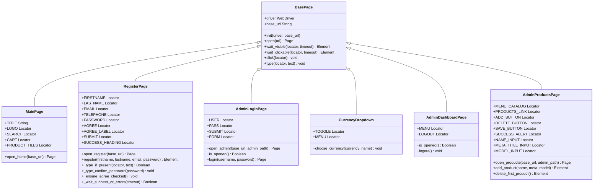

# Page Object Model Architecture

<cite>
**Referenced Files in This Document**   
- [pages/base.py](file://pages/base.py)
- [pages/main_page.py](file://pages/main_page.py)
- [pages/register_page.py](file://pages/register_page.py)
- [pages/admin/admin_login_page.py](file://pages/admin/admin_login_page.py)
- [pages/components/currency_dropdown.py](file://pages/components/currency_dropdown.py)
- [pages/admin/admin_dashboard_page.py](file://pages/admin/admin_dashboard_page.py)
- [pages/admin/admin_products_page.py](file://pages/admin/admin_products_page.py)
</cite>

## Table of Contents
1. [Introduction](#introduction)
2. [Core Design Principles](#core-design-principles)
3. [BasePage Class Implementation](#basepage-class-implementation)
4. [Locator Strategy and Page Attributes](#locator-strategy-and-page-attributes)
5. [Page-Specific Implementations](#page-specific-implementations)
6. [Inheritance Hierarchy and Method Delegation](#inheritance-hierarchy-and-method-delegation)
7. [Benefits for Test Stability and Readability](#benefits-for-test-stability-and-readability)
8. [Conclusion](#conclusion)

## Introduction
The Page Object Model (POM) is a design pattern widely used in test automation to create an object repository for web page elements. This document explores the implementation of POM in the current project, focusing on the inheritance structure, base utility methods, and encapsulation of user interactions. The architecture promotes code reuse, maintainability, and readability by abstracting low-level Selenium interactions into high-level page actions.

## Core Design Principles
The implementation follows key software engineering principles:
- **Single Responsibility**: Each page class manages only its own elements and actions
- **Encapsulation**: Locator strategies and interaction logic are hidden within page classes
- **Inheritance**: All page classes inherit from BasePage to share common functionality
- **Abstraction**: Complex user flows are represented as simple method calls

This structure ensures that changes to the UI require updates in only one location, significantly reducing maintenance overhead.

**Section sources**
- [pages/base.py](file://pages/base.py#L1-L35)
- [pages/main_page.py](file://pages/main_page.py#L1-L12)

## BasePage Class Implementation
The BasePage class serves as the foundation for all page objects, providing essential WebDriver interaction methods with built-in resilience.

### Core Methods
- **open(url)**: Navigates to the specified URL and returns self for method chaining
- **wait_visible(locator, timeout)**: Waits for element visibility using WebDriverWait and expected_conditions
- **wait_clickable(locator, timeout)**: Ensures element is both visible and enabled for interaction
- **click(locator)**: Attempts normal click first, falls back to JavaScript execution with scrollIntoView on failure
- **type(locator, text)**: Clears field and sends keystrokes after ensuring element visibility

The click() method implements intelligent scrolling behavior by using scrollIntoView({block:'center'}) to center the element in the viewport before attempting a JavaScript click, which helps overcome common issues with overlapping elements or viewport clipping.



**Diagram sources**
- [pages/base.py](file://pages/base.py#L25-L34)

**Section sources**
- [pages/base.py](file://pages/base.py#L1-L35)

## Locator Strategy and Page Attributes
Locators are defined as class attributes using Selenium's By tuples, enabling reuse across multiple methods within the page class.

### Locator Definition Pattern
```python
class RegisterPage(BasePage):
    FIRSTNAME = (By.CSS_SELECTOR, "#input-firstname")
    LASTNAME = (By.CSS_SELECTOR, "#input-lastname")
    EMAIL = (By.CSS_SELECTOR, "#input-email")
```

This approach provides:
- Centralized locator management
- IDE support for refactoring
- Type safety through consistent naming conventions
- Ability to use multiple selector strategies (CSS, XPath, ID) within the same page

Locators are referenced in page methods using self.LOCATOR_NAME, maintaining clean separation between locator definitions and their usage in interaction logic.

**Section sources**
- [pages/register_page.py](file://pages/register_page.py#L5-L15)
- [pages/main_page.py](file://pages/main_page.py#L5-L8)

## Page-Specific Implementations
Concrete page classes extend BasePage to implement domain-specific functionality while leveraging inherited methods.

### MainPage Example
MainPage demonstrates basic navigation patterns:
- Defines locators for key UI elements (LOGO, SEARCH, CART)
- Implements open_home() method that chains with BasePage.open()
- Inherits all interaction methods (click, type, wait_visible)

### RegisterPage Example
RegisterPage showcases complex interaction encapsulation:
- Implements register() method that orchestrates multiple field entries
- Handles edge cases like optional telephone field
- Manages password confirmation with fallback strategies
- Implements robust agreement checkbox handling with label clicking fallback
- Validates success through URL, title, and heading text

The register() method abstracts a complete user registration flow into a single, readable method call, hiding the complexity of form completion and validation.



**Diagram sources**
- [pages/register_page.py](file://pages/register_page.py#L50-L99)

**Section sources**
- [pages/main_page.py](file://pages/main_page.py#L1-L12)
- [pages/register_page.py](file://pages/register_page.py#L1-L99)

## Inheritance Hierarchy and Method Delegation
The inheritance structure creates a clear hierarchy where specialized page classes inherit and extend base functionality.



**Diagram sources**
- [pages/base.py](file://pages/base.py#L1-L35)
- [pages/main_page.py](file://pages/main_page.py#L1-L12)
- [pages/register_page.py](file://pages/register_page.py#L1-L99)
- [pages/admin/admin_login_page.py](file://pages/admin/admin_login_page.py#L1-L25)
- [pages/components/currency_dropdown.py](file://pages/components/currency_dropdown.py#L1-L11)
- [pages/admin/admin_dashboard_page.py](file://pages/admin/admin_dashboard_page.py#L1-L12)
- [pages/admin/admin_products_page.py](file://pages/admin/admin_products_page.py#L1-L40)

## Benefits for Test Stability and Readability
The implemented POM architecture delivers significant advantages:

### Test Stability
- **Resilient Interactions**: The click() method's fallback mechanism handles common WebDriver exceptions
- **Synchronized Operations**: All interactions include implicit waiting for element readiness
- **Centralized Maintenance**: Locator changes affect only one file rather than multiple test cases
- **Error Handling**: Complex validation logic (like registration success detection) is encapsulated in page objects

### Code Readability
- **Intent-Revealing APIs**: Method names like register() clearly express user intent
- **Reduced Code Duplication**: Common patterns (form filling, navigation) are abstracted into reusable components
- **Natural Language Flow**: Test cases read like user stories rather than technical instructions
- **Consistent Structure**: Uniform inheritance pattern makes codebase predictable and navigable

Tests become more maintainable and less brittle, as demonstrated by the clean separation between test logic in test_register_po.py and implementation details in register_page.py.

**Section sources**
- [pages/register_page.py](file://pages/register_page.py#L1-L99)
- [pages/base.py](file://pages/base.py#L1-L35)

## Conclusion
The Page Object Model implementation in this project exemplifies best practices in test automation architecture. By inheriting from BasePage, all page classes gain access to robust, reusable interaction methods while maintaining the ability to implement page-specific logic. The intelligent scrolling behavior in click() operations, combined with proper waiting strategies, significantly improves test reliability. Locator definitions as class attributes enable easy maintenance and refactoring. This architecture transforms complex UI interactions into simple, readable method calls, making tests more maintainable, stable, and expressive of user behavior.