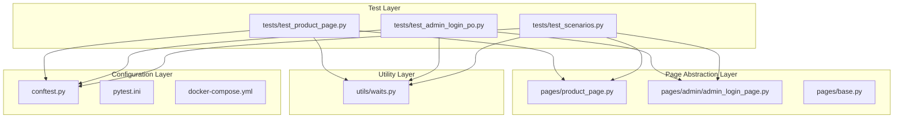
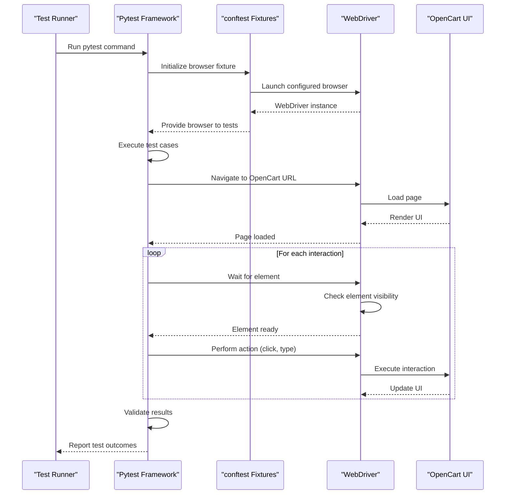
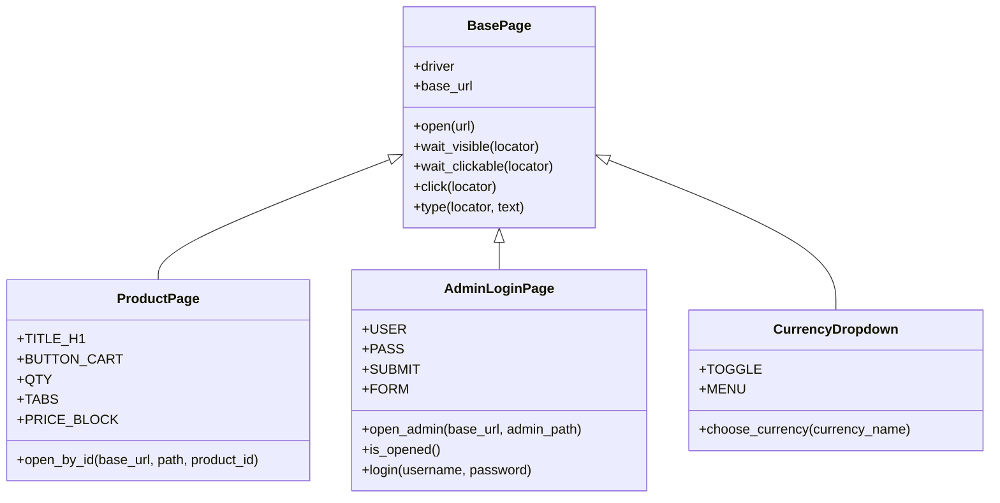
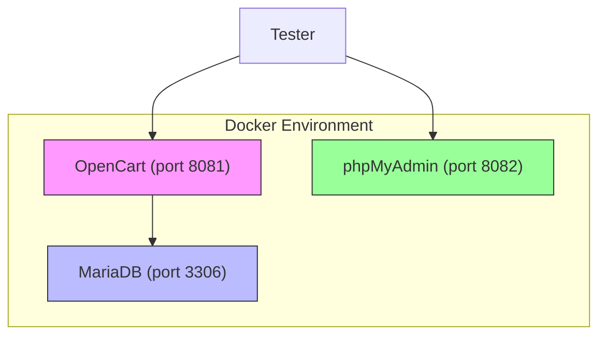

# Project Overview

<cite>
**Referenced Files in This Document**  
- [conftest.py](file://conftest.py)
- [pytest.ini](file://pytest.ini)
- [docker-compose.yml](file://docker-compose.yml)
- [pages/base.py](file://pages/base.py)
- [pages/product_page.py](file://pages/product_page.py)
- [pages/admin/admin_login_page.py](file://pages/admin/admin_login_page.py)
- [pages/components/currency_dropdown.py](file://pages/components/currency_dropdown.py)
- [tests/test_product_page.py](file://tests/test_product_page.py)
- [tests/test_product_page_po.py](file://tests/test_product_page_po.py)
- [tests/test_admin_login_po.py](file://tests/test_admin_login_po.py)
- [tests/test_scenarios.py](file://tests/test_scenarios.py)
- [utils/waits.py](file://utils/waits.py)
</cite>

## Table of Contents
1. [Introduction](#introduction)
2. [Framework Architecture](#framework-architecture)
3. [Core Components](#core-components)
4. [Test Execution Flow](#test-execution-flow)
5. [Page Object Model Implementation](#page-object-model-implementation)
6. [Cross-Browser Support and Configuration](#cross-browser-support-and-configuration)
7. [Docker Integration](#docker-integration)
8. [Test Styles: Procedural vs POM-Based](#test-styles-procedural-vs-pom-based)
9. [Target Audience and Use Cases](#target-audience-and-use-cases)
10. [CI/CD and Regression Testing Integration](#cicd-and-regression-testing-integration)

## Introduction

The OpenCart test automation framework is a robust browser-based end-to-end testing solution built using Python, Selenium WebDriver, and Pytest. It is designed to validate both frontend user workflows and backend administrative functions of the OpenCart e-commerce platform. The framework supports comprehensive testing scenarios ranging from basic UI element verification to complex administrative operations such as product management and user authentication.

This framework enables reliable, repeatable testing of OpenCart deployments through automated browser interactions that simulate real user behavior. It serves as a critical quality assurance tool for ensuring application stability across releases and deployments.

**Section sources**
- [conftest.py](file://conftest.py#L0-L80)
- [pytest.ini](file://pytest.ini#L0-L4)

## Framework Architecture

The framework follows a modular architecture with clear separation between test logic, page abstractions, utility functions, and configuration. The core components are organized into distinct directories:

- **tests/**: Contains all test cases, including both procedural and Page Object Model (POM)-based implementations
- **pages/**: Houses page classes that encapsulate UI interactions using the Page Object Model pattern
- **utils/**: Provides helper functions for common operations like explicit waits
- **conftest.py**: Defines pytest fixtures for browser management, configuration, and setup/teardown
- **docker-compose.yml**: Enables local environment orchestration with OpenCart, database, and phpMyAdmin

This architecture promotes maintainability, reusability, and scalability of test code across different testing scenarios.

**Diagram sources**
- [conftest.py](file://conftest.py#L0-L80)
- [pages/base.py](file://pages/base.py#L0-L34)
- [tests/test_product_page.py](file://tests/test_product_page.py#L0-L9)
- [tests/test_product_page_po.py](file://tests/test_product_page_po.py#L0-L8)

## Core Components

The framework's core functionality is built around several key components that work together to enable effective test automation. The `conftest.py` file provides essential pytest fixtures such as `browser`, `base_url`, and `wait`, which handle browser instantiation, configuration, and synchronization. The `BasePage` class in `pages/base.py` serves as the foundation for all page objects, providing common methods for navigation, element waiting, clicking, and typing.

Test cases in the `tests/` directory leverage these components to perform validations on both the storefront and administrative interfaces. Utility functions in `utils/waits.py` offer simplified waiting mechanisms for element visibility and presence.

**Section sources**
- [pages/base.py](file://pages/base.py#L0-L34)
- [utils/waits.py](file://utils/waits.py#L0-L28)
- [conftest.py](file://conftest.py#L0-L80)

## Test Execution Flow

The test execution flow begins with pytest invocation, which initializes the configured browser through the `browser` fixture. Tests then navigate to specific OpenCart URLs and interact with page elements either directly (procedural style) or through page object methods (POM style). All interactions are synchronized using explicit waits to ensure element availability before operations.

**Diagram sources**
- [conftest.py](file://conftest.py#L0-L80)
- [tests/test_product_page.py](file://tests/test_product_page.py#L0-L9)
- [tests/test_admin_login.py](file://tests/test_admin_login.py#L0-L11)

## Page Object Model Implementation

The framework implements the Page Object Model (POM) design pattern to enhance test maintainability and reduce code duplication. Each page in the application is represented by a corresponding Python class that encapsulates its elements and interactions. The `BasePage` class provides common functionality, while specific page classes like `ProductPage`, `AdminLoginPage`, and `CurrencyDropdown` extend it to implement page-specific behaviors.

For example, the `ProductPage` class defines locators for key elements such as the product title, add-to-cart button, and price block, along with methods to interact with them. This abstraction allows tests to work with high-level page operations rather than low-level element manipulation.

**Diagram sources**
- [pages/base.py](file://pages/base.py#L0-L34)
- [pages/product_page.py](file://pages/product_page.py#L0-L12)
- [pages/admin/admin_login_page.py](file://pages/admin/admin_login_page.py#L0-L24)
- [pages/components/currency_dropdown.py](file://pages/components/currency_dropdown.py#L0-L10)

## Cross-Browser Support and Configuration

The framework supports multiple browsers including Chrome, Firefox, and Safari through configurable pytest options. The `--browser` command-line argument allows users to specify their preferred browser, while the `--headless` flag enables headless execution for CI/CD environments. Browser-specific options are handled in the `browser` fixture in `conftest.py`, which configures appropriate WebDriver services and options.

The framework also supports customizable base URLs through the `--base-url` parameter, enabling testing against different OpenCart deployments. Default values are provided for convenience, but can be overridden via command line or environment variables.

**Section sources**
- [conftest.py](file://conftest.py#L0-L80)
- [pytest.ini](file://pytest.ini#L0-L4)

## Docker Integration

The framework includes Docker Compose configuration for local environment setup, allowing consistent testing across different development machines. The `docker-compose.yml` file defines services for OpenCart, MariaDB, and phpMyAdmin, enabling a complete e-commerce environment to be launched with a single command. This integration ensures that tests run against a known, consistent application state and simplifies onboarding for new team members.

The Docker configuration exposes OpenCart on port 8081 and phpMyAdmin on port 8082, with appropriate health checks to ensure service readiness before test execution.

**Diagram sources**
- [docker-compose.yml](file://docker-compose.yml#L0-L44)

## Test Styles: Procedural vs POM-Based

The framework supports two complementary test styles to accommodate different testing needs and expertise levels. Procedural tests (e.g., `test_product_page.py`) use direct Selenium calls and utility functions for simple, straightforward validations. These are ideal for quick smoke tests or exploratory automation.

POM-based tests (e.g., `test_product_page_po.py`) leverage page objects for more maintainable, readable tests that abstract away implementation details. These are better suited for complex workflows and long-term test suites. The coexistence of both styles allows teams to choose the appropriate approach based on test complexity and maintenance requirements.

For example, the procedural `test_product_page` directly uses `wait_element` calls with CSS selectors, while the POM-based `test_product_page_po` uses the `ProductPage` object's methods to achieve the same validation with cleaner, more expressive code.

**Section sources**
- [tests/test_product_page.py](file://tests/test_product_page.py#L0-L9)
- [tests/test_product_page_po.py](file://tests/test_product_page_po.py#L0-L8)
- [pages/product_page.py](file://pages/product_page.py#L0-L12)

## Target Audience and Use Cases

The framework serves multiple audiences within a software development organization:

- **QA Engineers**: Use the framework to create and execute test cases, validate bug fixes, and perform regression testing
- **Automation Developers**: Extend the framework with new page objects, utility functions, and test scenarios
- **DevOps Engineers**: Integrate the framework into CI/CD pipelines and manage test execution infrastructure

Key use cases include functional validation of new features, regression testing after code changes, cross-browser compatibility testing, and verification of administrative functionality. The framework's flexibility allows it to be used in both development and production-like environments.

**Section sources**
- [conftest.py](file://conftest.py#L0-L80)
- [tests/test_admin_login_po.py](file://tests/test_admin_login_po.py#L0-L19)
- [tests/test_scenarios.py](file://tests/test_scenarios.py#L0-L20)

## CI/CD and Regression Testing Integration

The framework is designed for seamless integration into CI/CD pipelines and regression testing workflows. Its command-line interface, configurable parameters, and headless browser support make it suitable for automated execution in continuous integration environments. The use of pytest provides detailed reporting and easy integration with CI tools like Jenkins, GitLab CI, or GitHub Actions.

Regression testing is facilitated through organized test suites that can be selectively executed using pytest markers (e.g., `@pytest.mark.admin` for administrative tests). The framework's modular design allows specific test groups to be targeted based on the areas affected by code changes, optimizing test execution time in CI pipelines.

**Section sources**
- [pytest.ini](file://pytest.ini#L0-L4)
- [conftest.py](file://conftest.py#L0-L80)
- [tests/test_admin_login_po.py](file://tests/test_admin_login_po.py#L0-L19)