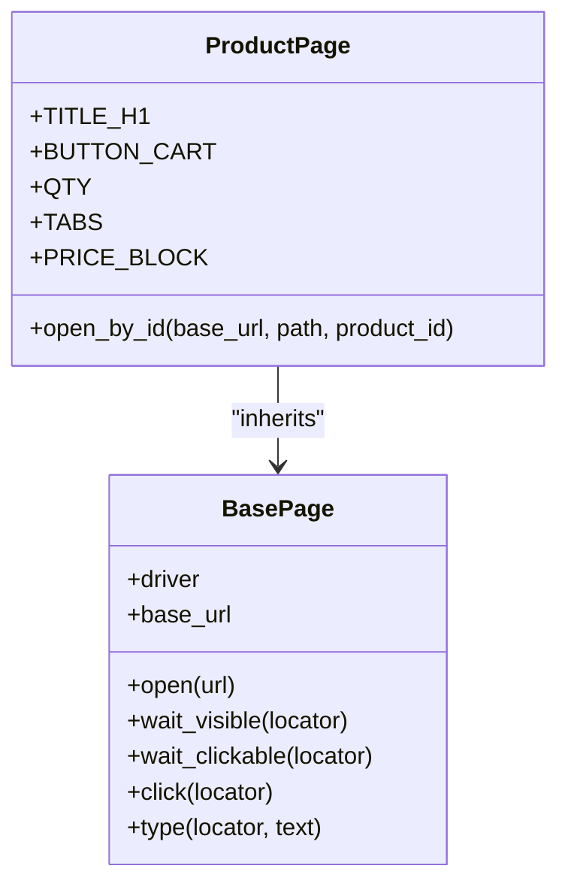
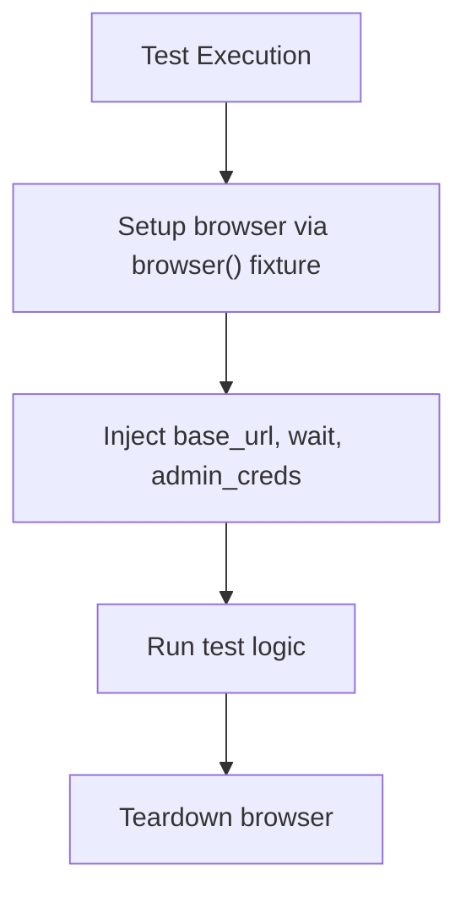
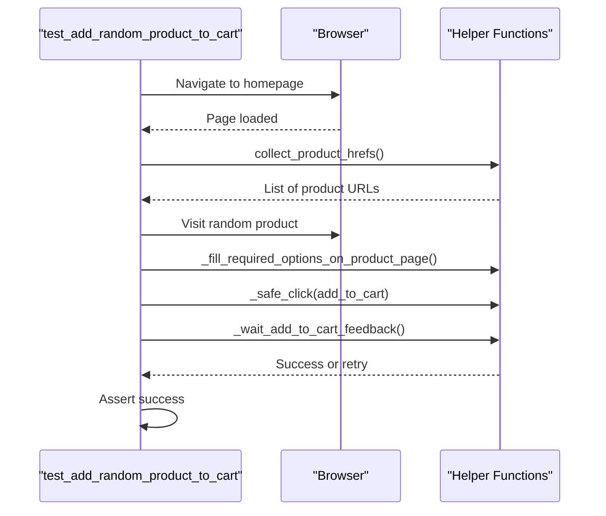

# Test Writing Guide

<cite>
**Referenced Files in This Document**   
- [test_main_page.py](file://tests/test_main_page.py)
- [test_product_page_po.py](file://tests/test_product_page_po.py)
- [product_page.py](file://pages/product_page.py)
- [base.py](file://pages/base.py)
- [test_scenarios.py](file://tests/test_scenarios.py)
- [conftest.py](file://conftest.py)
- [pytest.ini](file://pytest.ini)
</cite>

## Table of Contents
1. [Introduction](#introduction)
2. [Procedural vs. Page Object Model (POM) Tests](#procedural-vs-page-object-model-pom-tests)
3. [Writing Procedural Tests](#writing-procedural-tests)
4. [Writing POM-Based Tests](#writing-pom-based-tests)
5. [Test Organization and Naming Conventions](#test-organization-and-naming-conventions)
6. [Fixture Usage and Dependency Management](#fixture-usage-and-dependency-management)
7. [Parameterized Testing](#parameterized-testing)
8. [Assertion Patterns and Reliability](#assertion-patterns-and-reliability)
9. [Multi-Step Scenario Testing](#multi-step-scenario-testing)
10. [Templates for New Test Files](#templates-for-new-test-files)
11. [Anti-Patterns to Avoid](#anti-patterns-to-avoid)
12. [Conclusion](#conclusion)

## Introduction
This guide provides comprehensive best practices for writing effective automated tests in a Selenium-based Python framework. It contrasts two primary testing approaches: procedural tests and Page Object Model (POM)-based tests. Using real examples from the codebase, it demonstrates how to structure tests, manage dependencies, use fixtures, and write reliable assertions. The goal is to help developers and QA engineers create maintainable, readable, and robust test suites.

## Procedural vs. Page Object Model (POM) Tests
The project implements two distinct testing patterns: procedural and POM-based. Procedural tests directly interact with the browser using Selenium commands within test functions, while POM-based tests encapsulate page interactions within dedicated classes. Each approach has specific use cases and trade-offs.

Procedural tests are ideal for simple, one-off validations or exploratory testing where speed of implementation is prioritized over long-term maintenance. POM-based tests are better suited for complex, reusable workflows and large-scale test suites where maintainability and readability are critical.

**Section sources**
- [test_main_page.py](file://tests/test_main_page.py#L1-L10)
- [test_product_page_po.py](file://tests/test_product_page_po.py#L1-L9)

## Writing Procedural Tests
Procedural tests use direct Selenium calls and utility functions to validate page elements. They are straightforward to write and understand but can become difficult to maintain as application UI changes.

In `test_main_page.py`, the test function `test_main_page_elements` navigates to the base URL and verifies the presence of key elements such as the logo, search input, cart button, and product listings. It relies on custom wait utilities from `utils.waits` to ensure elements are visible before assertion.

This style is effective for smoke tests or quick validations but duplicates locator logic across test files, increasing maintenance overhead when UI elements change.

**Section sources**
- [test_main_page.py](file://tests/test_main_page.py#L1-L10)

## Writing POM-Based Tests
POM-based tests encapsulate page-specific locators and actions within dedicated classes, promoting reusability and separation of concerns. The `ProductPage` class in `product_page.py` defines static locators for key elements like the title, add-to-cart button, quantity field, tabs, and price block.

In `test_product_page_po.py`, the test instantiates `ProductPage`, opens a specific product URL, and validates visibility of all major components using the page object's built-in `wait_visible` method inherited from `BasePage`. This abstraction hides implementation details from the test, making it more readable and less brittle.

The POM approach centralizes UI interaction logic, so changes to element selectors only require updates in one location.

**Diagram sources**
- [pages/base.py](file://pages/base.py#L1-L35)
- [pages/product_page.py](file://pages/product_page.py#L1-L13)

**Section sources**
- [test_product_page_po.py](file://tests/test_product_page_po.py#L1-L9)
- [pages/product_page.py](file://pages/product_page.py#L1-L13)
- [pages/base.py](file://pages/base.py#L1-L35)

## Test Organization and Naming Conventions
The test suite follows a consistent naming convention: test files are prefixed with `test_` and named after the page or feature being tested. Files ending in `_po.py` indicate POM-based tests, while those without the suffix use procedural style.

Tests are organized under the `tests/` directory with clear separation between different functional areas such as admin, catalog, currency, and registration. This structure makes it easy to locate relevant tests and understand their scope.

**Section sources**
- [test_main_page.py](file://tests/test_main_page.py#L1-L10)
- [test_product_page_po.py](file://tests/test_product_page_po.py#L1-L9)

## Fixture Usage and Dependency Management
The `conftest.py` file defines several pytest fixtures that manage test dependencies. The `browser` fixture initializes a WebDriver instance based on command-line arguments for browser type and headless mode. It supports Chrome, Firefox, and Safari with appropriate configuration.

Other fixtures like `base_url`, `admin_path`, and `admin_creds` provide configuration values from command-line options or environment variables. The `wait` fixture creates a WebDriverWait instance for explicit waits, reducing flakiness in dynamic UIs.

These fixtures promote consistency across tests and eliminate redundant setup code.

**Diagram sources**
- [conftest.py](file://conftest.py#L1-L80)

**Section sources**
- [conftest.py](file://conftest.py#L1-L80)

## Parameterized Testing
The framework supports parameterized testing using `@pytest.mark.parametrize`. In `test_scenarios.py`, currency switching tests are parameterized with different currency names and symbols (Euro, Pound, Dollar), allowing the same test logic to validate multiple configurations.

This reduces code duplication and ensures consistent behavior across variations. The `pytest.ini` file configures global pytest options including verbose output and custom markers like `admin` for tagging tests requiring administrative access.

**Section sources**
- [test_scenarios.py](file://tests/test_scenarios.py#L200-L250)
- [pytest.ini](file://pytest.ini#L1-L5)

## Assertion Patterns and Reliability
Tests use a combination of explicit waits and state checks to ensure reliability. Instead of relying solely on element presence, they verify functional outcomes such as cart count increments or success message displays.

Helper functions like `_wait_add_to_cart_feedback` in `test_scenarios.py` encapsulate complex assertion logic, checking multiple possible indicators of success (cart counter, alert messages, mini-cart contents). This resilience prevents false failures due to minor UI variations.

**Section sources**
- [test_scenarios.py](file://tests/test_scenarios.py#L100-L150)

## Multi-Step Scenario Testing
Complex user journeys are implemented in `test_scenarios.py` as multi-step tests. For example, adding a random product to the cart involves navigating to the homepage, collecting product links, selecting one at random, filling required options, clicking "Add to Cart", and verifying the result through multiple feedback mechanisms.

These scenarios simulate real user behavior and validate end-to-end functionality. They use helper functions to handle dynamic content like required product options (dropdowns, text fields, dates) that vary by product.

**Diagram sources**
- [test_scenarios.py](file://tests/test_scenarios.py#L150-L200)

**Section sources**
- [test_scenarios.py](file://tests/test_scenarios.py#L150-L300)

## Templates for New Test Files
When creating new test files, follow the existing patterns:
- Use `test_<feature>.py` for procedural tests
- Use `test_<feature>_po.py` for POM-based tests
- Import necessary page objects or utilities
- Leverage existing fixtures (`browser`, `wait`, `base_url`)
- Prefer POM for reusable components
- Use parameterization for multiple test cases

For POM classes, inherit from `BasePage` and define locators as class constants using `(By.CSS_SELECTOR, "...")` tuples.

## Anti-Patterns to Avoid
Avoid the following anti-patterns:
- Duplicating locators across test files (use POM instead)
- Using implicit waits excessively (rely on explicit waits)
- Hardcoding URLs or credentials (use fixtures)
- Writing overly broad selectors that may match unintended elements
- Skipping cleanup or state reset between tests
- Ignoring dynamic content like required product options

Also avoid mixing procedural and POM styles within the same test file, as this reduces clarity and maintainability.

## Conclusion
Choosing between procedural and POM-based testing depends on the complexity and longevity of the test suite. For simple, short-lived tests, procedural style offers rapid development. For scalable, maintainable automation, POM provides superior structure and reuse. By leveraging fixtures, parameterization, and robust assertion patterns, this framework supports both approaches effectively while promoting best practices in test design.