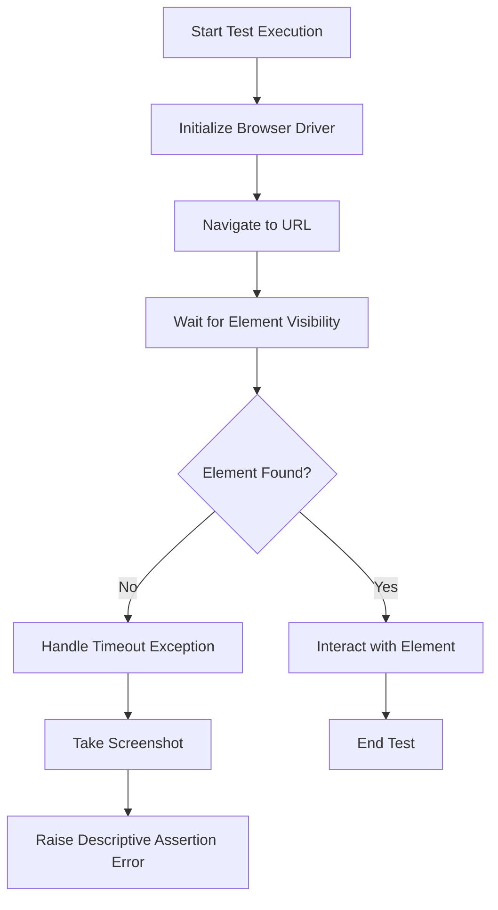
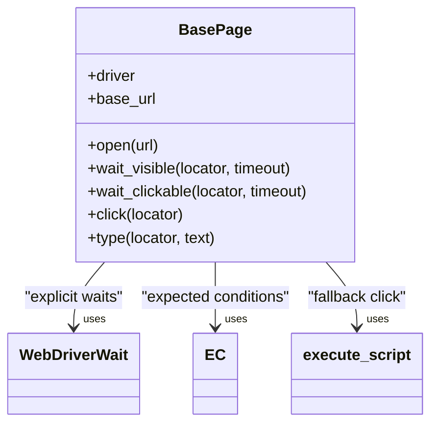
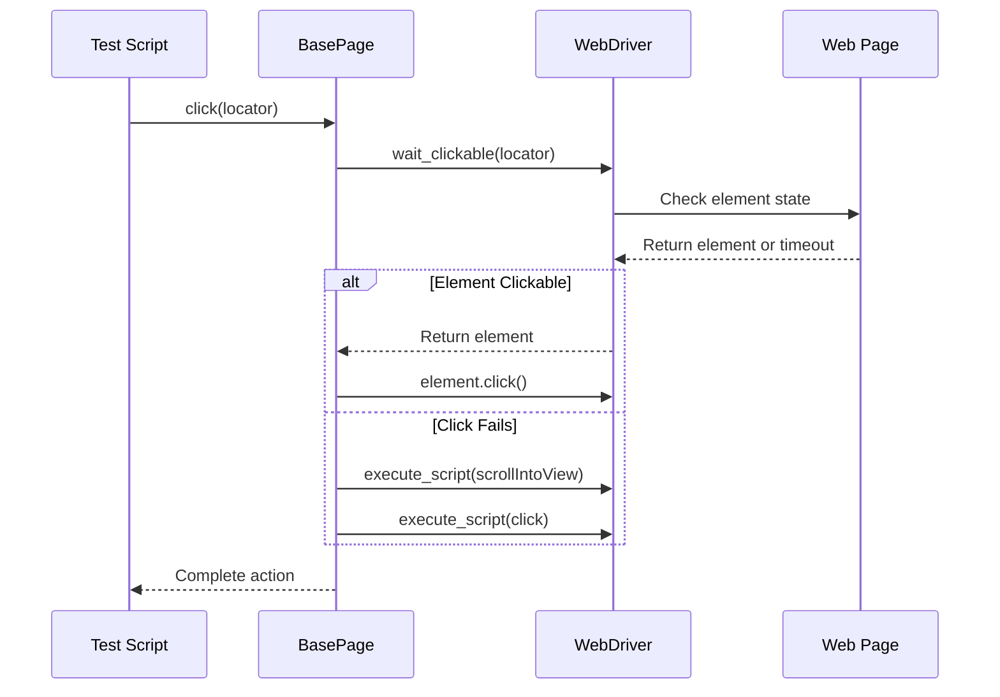

# Troubleshooting

<cite>
**Referenced Files in This Document**   
- [base.py](file://pages/base.py)
- [waits.py](file://utils/waits.py)
- [conftest.py](file://conftest.py)
- [test_scenarios.py](file://tests/test_scenarios.py)
</cite>

## Table of Contents
1. [Introduction](#introduction)
2. [Common Test Execution Issues](#common-test-execution-issues)
3. [Diagnosing Selenium and Pytest Errors](#diagnosing-selenium-and-pytest-errors)
4. [Resolving Element Visibility and Interaction Problems](#resolving-element-visibility-and-interaction-problems)
5. [Handling Synchronization and Timing Issues](#handling-synchronization-and-timing-issues)
6. [Debugging Workflow Recommendations](#debugging-workflow-recommendations)
7. [Conclusion](#conclusion)

## Introduction
This document provides a comprehensive guide to diagnosing and resolving common issues encountered during automated test execution using Selenium and pytest. It focuses on practical solutions for browser driver initialization failures, element not found exceptions, timeout errors, and synchronization problems. Special attention is given to leveraging the smart scrolling mechanism in `base.py` and custom wait functions in `waits.py` to overcome visibility and interaction challenges. The guide also includes recommended debugging workflows such as enabling verbose logging, capturing screenshots on failure, and utilizing browser developer tools effectively.

## Common Test Execution Issues

### Browser Driver Initialization Failures
Browser driver initialization can fail due to missing drivers, incompatible versions, or incorrect configuration. The `conftest.py` file defines a `browser` fixture that supports Chrome, Firefox, and Safari with configurable options including headless mode and window size. Ensure that the correct driver binaries are installed and accessible in the system PATH.

### Element Not Found Exceptions
These occur when Selenium cannot locate an element using the provided locator strategy. Common causes include dynamic content loading, incorrect selectors, or timing issues. The framework uses explicit waits in both `BasePage` methods and utility functions in `waits.py` to mitigate this issue.

### Timeout Errors
Timeouts happen when elements do not become visible or interactive within the expected timeframe. The framework implements default timeouts of 7-10 seconds in wait functions, which can be adjusted based on application performance characteristics.

### Synchronization Problems
Asynchronous operations like AJAX calls or animations can cause race conditions between test scripts and page state. The framework addresses these through WebDriverWait mechanisms and custom polling logic.

**Section sources**
- [conftest.py](file://conftest.py#L45-L80)
- [base.py](file://pages/base.py#L10-L34)
- [waits.py](file://utils/waits.py#L5-L28)

## Diagnosing Selenium and Pytest Errors

### Interpreting Selenium Exceptions
Key exceptions include:
- **NoSuchElementException**: Locator does not match any element
- **ElementNotVisibleException**: Element exists in DOM but is not visible
- **ElementNotInteractableException**: Element is visible but cannot be interacted with
- **StaleElementReferenceException**: Referenced element is no longer attached to DOM

The `waits.py` module handles `TimeoutException` by automatically saving screenshots with session IDs, aiding in post-failure analysis.

### Understanding Pytest Output
Pytest configuration in `pytest.ini` enables verbose output (`-v`) and shows short tracebacks (`--tb=short`). Failed assertions in custom wait functions provide descriptive messages about missing elements or incorrect page titles, making it easier to identify root causes.

**Diagram sources**
- [waits.py](file://utils/waits.py#L5-L28)
- [conftest.py](file://conftest.py#L45-L80)

**Section sources**
- [waits.py](file://utils/waits.py#L5-L28)
- [pytest.ini](file://pytest.ini#L1-L5)

## Resolving Element Visibility and Interaction Problems

### Elements Not Clickable Due to Overlay
When elements are obscured by overlays or fixed headers, standard clicks fail. The `click()` method in `BasePage` implements a fallback mechanism using JavaScript execution after scrolling the element into view at the center of the viewport.

### Stale Element References
Elements may become stale due to page refreshes or dynamic content updates. Tests should re-locate elements when encountering `StaleElementReferenceException`. The `test_currency_po.py` demonstrates proper handling by catching the exception and continuing the probe loop.

### Unexpected Alert Dialogs
Alerts can interrupt normal test flow. While not directly handled in the current framework, tests should anticipate alerts using `expected_conditions.alert_is_present()` and handle them appropriately with `switch_to.alert`.

**Diagram sources**
- [base.py](file://pages/base.py#L1-L34)

**Section sources**
- [base.py](file://pages/base.py#L1-L34)
- [test_scenarios.py](file://tests/test_scenarios.py#L0-L20)

## Handling Synchronization and Timing Issues

### Custom Wait Strategies
The `waits.py` module provides three key functions:
- `wait_element()`: Waits for single element visibility
- `wait_all()`: Waits for all elements in collection to be visible
- `wait_title()`: Validates page title matches expected value

These functions incorporate automatic screenshot capture on timeout, providing visual context for debugging.

### Smart Scrolling Mechanism
The `BasePage.click()` method includes a robust scrolling mechanism that centers the target element before attempting a JavaScript-based click if the standard click fails. This approach resolves issues caused by elements being outside the viewport or partially obscured.

### Dynamic Content Handling
For pages with dynamically loaded content, use `wait_all()` to ensure all expected elements have loaded, or implement custom expected conditions as shown in `test_currency_po.py` where a custom function checks for currency symbol presence across multiple price elements.

**Section sources**
- [waits.py](file://utils/waits.py#L5-L28)
- [base.py](file://pages/base.py#L25-L34)
- [test_currency_po.py](file://tests/test_currency_po.py#L15-L24)

## Debugging Workflow Recommendations

### Enable Verbose Logging
Run tests with `--tb=short` and `-v` flags as configured in `pytest.ini` to get detailed output about test execution flow and failure points.

### Capture Screenshots on Failure
The `waits.py` module automatically saves screenshots when element wait timeouts occur, using the driver session ID as the filename. This provides immediate visual feedback about the application state at the time of failure.

### Use Browser Developer Tools
Run tests in non-headless mode by omitting the `--headless` flag to observe test execution in real-time. This allows manual inspection of the DOM, network activity, and console errors that might affect test stability.

### Leverage Helper Functions
The `test_scenarios.py` file contains utility functions like `_scroll_into_view()` and `_safe_click()` that can be reused across tests to handle common interaction patterns reliably.

**Diagram sources**
- [base.py](file://pages/base.py#L25-L30)
- [test_scenarios.py](file://tests/test_scenarios.py#L0-L20)

**Section sources**
- [base.py](file://pages/base.py#L25-L34)
- [test_scenarios.py](file://tests/test_scenarios.py#L0-L20)

## Conclusion
Effective troubleshooting of automated tests requires understanding both the testing framework's capabilities and the underlying web application behavior. By leveraging the built-in mechanisms such as smart scrolling in `base.py` and screenshot capture in `waits.py`, combined with proper debugging practices like running in non-headless mode and analyzing pytest output, teams can significantly improve test reliability and maintainability. Always prioritize explicit waits over implicit waits and handle expected exceptions gracefully to create robust test suites.